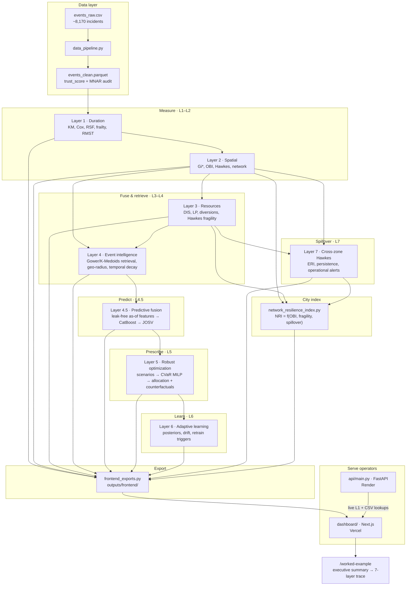

# Converge — ASTraM Bengaluru Traffic Disruption Intelligence.

**Framing:** From reactive patrol logs to a **seven-layer** predictive, prescriptive, and self-improving disruption-intelligence system for Bengaluru — with a **Next.js ops dashboard** (Vercel) and a **thin FastAPI inference service** (Render) for live worked examples.

## Architecture (at a glance)



### Surfaces

| Surface | URL | Who it's for |
|---------|-----|--------------|
| **Home** | `/` | Visitors — live KPIs from real exports + mini pipeline demo |
| **Overview** | `/overview` | Command view — **NRI**, flow diagram, mini-map |
| **Layers L1–L7** | `/layer1` … `/layer7` | Judges / analysts — methodology depth per layer |
| **Worked Example** | `/worked-example` | **Operators first** — one recommendation card, then full trace |
| **Hotspot map** | `/map` | Spatial ops — Layer 2 junction view |
| **Methodology** | `/methodology` | Honesty page — limitations and caveats |

Deploy: `VERCEL_DEPLOYMENT.md` (dashboard), `RENDER_DEPLOYMENT.md` + `render.yaml` (API).

## Problem statement

Political rallies, festivals, sports events, construction, and sudden gatherings create localized traffic breakdowns in Bengaluru. Today:

- **Event impact is not quantified in advance** — dispatch relies on experience, not data
- **Resource deployment is experience-driven** — no baseline for where to send manpower or barricades
- **No post-event learning system** — similar events are handled from scratch each time

**Goal:** Use historical and real-time ASTraM data to forecast event-related traffic impact and recommend optimal manpower, barricading, and diversion plans.

Layers 1 and 2 are the **measurement layer** — they quantify *how long* and *where* disruption concentrates. Layers 3–5 turn those numbers into deployment plans; Layer 6 monitors and learns; Layer 7 models cross-zone spillover; the **dashboard** surfaces the answer for operators.

## How Layers 1 & 2 address the problem

| Pain point | Layer | What it delivers |
|------------|-------|------------------|
| Impact not quantified | **Layer 1** | P50/P80/P95 duration quantiles by `(event_cause × corridor)` — e.g. breakdowns on Mysore Road: median ~39 min, P80 ~74 min |
| Deployment is guesswork (where) | **Layer 2** | 80 statistically significant junction hotspots (Gi*), not just a busy map — Silk Board, Goruguntepalya, Mysore Rd toll gate |
| Sparse planned events (191 true events / 8,173 rows) | **Layer 1** | `lookup_expected_duration()` returns `None` for sparse causes (e.g. protest) → triggers Layer 4 case retrieval |

### Layer 1 — time dimension (“how long will this corridor stay degraded?”)

Kaplan-Meier survival curves answer operational questions directly:

- **“How long should we block this lane?”** → P80 duration for that cause × corridor
- **“When can we redeploy this team?”** → P80 = time until 80% of similar incidents cleared
- **“Is this estimate trustworthy?”** → weighted by `trust_score`; sparse strata fall back or return `None`

Layer 1 feeds Layer 3 resource sizing:
$$
\text{manpower\\_needed} \approx f(\text{impact\\_score},\ \text{expected\\_duration},\ \text{requires\\_road\\_closure}) \\
\text{barricade\\_window} = [\text{start},\ \text{start} + P_ {80,\text{duration}}], \qquad \\
\text{diversion\\_window} = \text{barricade\\_window}
$$

### Layer 2 — spatial dimension (“where should we pre-position resources?”)

Getis-Ord Gi* tests whether a junction is **anomalously hot**, not merely busy. Trust-weighted intensity (`sum(trust_score)`) prevents low-quality rows from inflating hotspots.

Layer 2 feeds Layer 3 placement:
$$
\text{pre\\_position\\_manpower}(j) \propto G_ {i}^{*}\ \text{significance} \times \text{weighted\\_intensity} \\
\text{priority\\_barricade\\_points} = \text{hotspots} \cap \text{planned\\_event\\_route}, \qquad \\
\text{diversion\\_candidates} = \{\text{corridors adjacent to significant hotspots}\}
$$

### Worked example — breakdown at a known hotspot

| Input | Layer | Output |
|-------|-------|--------|
| `vehicle_breakdown`, Mysore Road | L1 | P50 ~39 min, P80 ~74 min |
| Silk Board Junction | L2 | Significant hotspot (p_sim = 0.006) |
| **Layer 3 (next)** | — | Pre-position tow + patrol; plan ~40–80 min disruption window; prioritize alternate ORR arm |
| **Worked Example (live)** | `/worked-example` | Executive summary card (headline + duration + officers) then full L1–L7 trace with provenance |

### What Layers 1 & 2 deliver, and what later layers add

| Problem piece | Status |
|---------------|--------|
| Forecast duration / spatial risk | **Done** (L1 + L2) |
| Recommend specific manpower counts | **Done** (Layer 3 — see Layer 3 Resource Optimization section) |
| Barricade coordinates / diversion routes | **Done** (Layer 3 — see Layer 3 Resource Optimization section) |
| Post-event learning loop | **Done** (Layer 6 — see Layer 6 Adaptive Learning section) |

## Dataset

- **Source:** ASTraM / Bengaluru Traffic Police operational log (~8,170 incidents, Nov 2023 – Apr 2024)
- **Raw file:** `data/events_raw.csv`
- **Cleaned output:** `data/events_clean.parquet` (+ `.csv`)

## What is `trust_score`?

A single row-level confidence weight in **[0, 1]**, computed as a **noisy-OR** over four independent evidence flags:
$$
\text{trust}_ {i} = \prod_ {k} \bigl(1 - w_ {k} \cdot \text{flag}_ {k,i}\bigr)
$$

| Flag | Weight | Meaning |
|------|--------|---------|
| `duration_anomaly` | 0.30 | Stratified MAD outlier within (cause × corridor) |
| NOT `geo_valid` | 0.40 | Missing or placeholder (0,0) coordinates |
| MNAR censored | 0.30 | Censored + logistic P(missing) > 0.7 |
| `iso_flagged` | 0.30 | Bottom 5% Isolation Forest anomaly score |

**Why it replaces global truncation:** A single 1440-minute cutoff cannot distinguish "12-hour ORR East 2 construction is normal" from "12-hour vehicle breakdown is bad data." Stratified MAD (`|modified_z| > 3.5`) flags anomalies *within context*.

Low-trust rows are **not deleted** — they contribute proportionally less to Kaplan-Meier fits (`weights=`) and Gi* intensity (`sum(trust_score)`).

## Missingness test

The pipeline fits a logistic regression predicting $P(\text{no end timestamp} \mid \text{corridor, priority, cause, closure, hour})$ and runs a likelihood-ratio test against an intercept-only model. Results are saved to `outputs/missingness_test.txt`.

**Key finding:** ~3,500+ rows marked `status=closed` have **no** end timestamp at all — status and timestamp fields are inconsistently maintained in the source system. This is reported explicitly in the pipeline summary.

## Layer 1 — Survival analysis

- **Kaplan-Meier** stratified by `(event_cause, corridor)` with `MIN_GROUP_SIZE=15`
- Uses **trust-weighted** fits on rows with observed `duration_min` only (~3,500 resolved incidents)
- Censored rows (no end timestamp) are excluded from KM quantiles but down-weighted via `trust_score` in the cleaned table; including them with administrative censoring would inflate quantiles to study-horizon (~160 days) and destroy operational readability
- Fallback table by `event_cause` only for sparse strata
- **Cox PH** on priority, closure flag, cyclical time, top-8 corridor dummies (concordance ~0.56 — weak covariate signal; cause×corridor matters more)
- Outputs: `outputs/layer1_survival_quantiles.csv`, `layer1_survival_fallback.csv`, `layer1_cox_summary.txt`

Public API: `lookup_expected_duration(cause, corridor, km_table, km_fallback, quantile="p50")`

## Layer 2 — Getis-Ord Gi* hotspots

- Trust-weighted junction intensity (not raw counts)
- KNN spatial weights (k=6), permutation `p_sim < 0.05` as **primary** significance test
- Output: `outputs/layer2_hotspots.csv`

## Setup

```bash
python3 -m venv .venv
source .venv/bin/activate
pip install -r requirements.txt
```

## Run (in order)

```bash
python src/data_pipeline.py
python src/layer1_survival.py    # baseline KM/Cox + advanced survival models
python src/layer2_hotspots.py    # baseline Gi* + advanced hotspot intelligence
python src/layer1_research_upgrades.py  # frailty LRT + stacked ensemble (additive)
python src/layer2_research_upgrades.py  # MSHI + Monte Carlo OBI stability (additive)
python src/layer3_resource_optimization.py
python src/layer4_event_intelligence.py
python src/layer3_corridor_fragility.py    # additive: Hawkes corridor fragility
python src/layer4_planned_event_retrieval.py  # additive: prototype retrieval
python src/layer3_methodology_upgrades.py   # PCA stability + log fragility (additive)
python src/layer4_methodology_upgrades.py   # leakage-free retrieval + K-Medoids (additive)
python src/layer4_operational_upgrades.py   # evidence tiers + quantiles + L3 fallback (final L4)
python src/layer45_predictive_fusion.py     # leak-free predictive fusion → JOSV (additive)
python src/layer5_robust_optimization.py   # prescriptive MILP optimization → allocation + diversion (additive)
python src/layer6_adaptive_learning.py     # adaptive learning → posteriors + triggers (additive, never mutates upstream)
python src/layer7_cross_zone_hawkes.py     # cross-zone spillover + graph centrality (additive)
python src/network_resilience_index.py     # city-level NRI from L2/L3/L7 outputs (additive)
python src/frontend_exports.py              # dashboard-ready copies → outputs/frontend/
python src/validate_consistency.py
```

Each layer script runs **baseline first, then advanced**, writing outputs to `outputs/layer1_*` … `outputs/layer7_*`.

## Dashboard & live inference

### Local development

```bash
# Terminal 1 — inference API (required for /worked-example and /scenario live runs)
cd api && pip install -r requirements.txt
uvicorn main:app --reload --port 8000

# Terminal 2 — dashboard
cd dashboard && npm install && cp .env.example .env.local   # set NEXT_PUBLIC_API_URL=http://localhost:8000
npm run dev
```

Open `http://localhost:3000`. Layer pages read **`outputs/frontend/`** (CSV, 30s revalidate cache). Worked Example POSTs to the API: Layer 1 recomputes live when `data/events_clean.parquet` is present; Layers 2–7 are keyed lookups from `outputs/` with honest provenance badges.

### Dashboard highlights

| Feature | Where | Source |
|---------|-------|--------|
| Live hero KPIs | `/` | `loadHeroStats()` — RSF C-index, CVaR reduction, spillover LRT p-value, critical retrain triggers from CSVs |
| **Network Resilience Index** | `/overview` | `outputs/frontend/network_resilience_index.csv` |
| Geo-radius retrieval map | `/layer4` | `layer4_geo_radius_matches.csv` |
| Temporal decay / retrain context | `/layer4` | `layer4_temporal_decay_summary.csv` |
| MILP counterfactual panel | `/layer5` | `layer5_counterfactual_analysis.csv` |
| Graph centrality | `/layer7` | `layer7_graph_centrality.csv` |
| **Executive summary card** | `/worked-example` | API `recommendation.headline` + `duration_plan` + `officer_plan` in one card before the 7-layer pipe |

### Repo layout (runtime)

```
converge/
├── data/                    # events_raw.csv, events_clean.parquet (gitignored parquet)
├── outputs/                 # batch pipeline CSVs (~committed for Vercel)
│   └── frontend/            # dashboard read path (frontend_exports.py + direct writes)
├── src/                     # Python pipeline (L1–L7, NRI, exports)
├── api/                     # FastAPI thin inference (Render)
├── dashboard/               # Next.js 15 app (Vercel)
├── render.yaml              # Render blueprint
├── VERCEL_DEPLOYMENT.md
└── RENDER_DEPLOYMENT.md
```

## Layer 1 outputs (`layer1_survival.py`)

| Section | Models | Output files |
|---------|--------|--------------|
| **Baseline** | Kaplan-Meier (cause×corridor), Cox PH | `layer1_survival_quantiles.csv`, `layer1_survival_fallback.csv`, `layer1_cox_summary.txt` |
| **Advanced** | Frailty, AFT, RSF, RMST, GMM | `layer1_frailty_scores.csv`, `layer1_duration_predictions.csv`, `layer1_survival_risk_scores.csv`, `layer1_rmst_summary.csv`, `layer1_incident_archetypes.csv`, … |
| **Research upgrades** | Frailty LRT, stacked ensemble | `layer1_frailty_validation.csv`, `layer1_frailty_interpretation.txt`, `layer1_stacked_survival_predictions.csv`, `layer1_stacked_survival_metrics.csv` |

## Layer 2 outputs (`layer2_hotspots.py`)

| Section | Models | Output files |
|---------|--------|--------------|
| **Baseline** | Trust-weighted Getis-Ord Gi* | `layer2_hotspots.csv` |
| **Advanced** | Severity, spatiotemporal Gi*, network Gi*, Hawkes, persistence, future risk, OBI | `layer2_severity_hotspots.csv`, `layer2_network_hotspots.csv`, `layer2_operational_burden_index.csv`, … |
| **Research upgrades** | Multi-scale Gi* (MSHI), Monte Carlo OBI stability | `layer2_multiscale_hotspots.csv`, `layer2_obi_stability.csv`, `layer2_obi_stable_top25.csv` |

## Advanced models (integrated into Layer 1 & 2)

### Why advanced models beat baseline KM + Gi*

| Limitation of baseline | Advanced remedy |
|------------------------|-----------------|
| KM ignores covariate interactions | Random Survival Forest (C-index ~0.62 OOB vs Cox ~0.56) |
| Cox gives hazard ratios, not minutes | AFT models predict median/P90 duration directly |
| Corridors differ in hidden ops capacity | Frailty / clearance multipliers by corridor |
| Median hides tail risk for planners | RMST(τ) = expected occupation time up to τ |
| One-size duration bucket | GMM latent archetypes (quick / moderate / severe) |
| Gi* counts incidents, not burden | Severity = Trust × Duration × Priority |
| Euclidean KNN ignores road topology | Network-constrained Gi* on corridor graph |
| Static map misses rush-hour patterns | Spatiotemporal Gi* by hour × day-of-week |
| No cascade awareness | Hawkes self-exciting intensity per junction |
| Hotspot today ≠ hotspot always | Weekly persistence index (transient / chronic) |
| Reactive not predictive | Graph ML future hotspot risk score |
| Many metrics, one decision | **Operational Burden Index (OBI)** |

### Layer 1 formulas (all in `layer1_survival.py`)

| Model | Formula | Output |
|-------|---------|--------|
| **Kaplan-Meier** | $\hat{S}(t) = \prod_ {i} (1 - d_ {i}/n_ {i})$, trust-weighted | `layer1_survival_quantiles.csv` |
| **Cox PH** | $h(t \mid X) = h_ {0}(t)\, e^{\beta X}$ | `layer1_cox_summary.txt` |
| **Frailty** | Corridor clearance multiplier = global median / corridor median | `layer1_frailty_scores.csv` |
| **AFT** | Weibull + LogNormal; lowest AIC wins | `layer1_duration_predictions.csv` |
| **RSF** | Random Survival Forest (`scikit-survival`) | `layer1_survival_risk_scores.csv` |
| **RMST** | $\int_ {0}^\tau S(t)\,dt$ for τ ∈ {60,180,360,720} min | `layer1_rmst_summary.csv` |
| **GMM** | Latent duration archetypes (BIC selects K) | `layer1_incident_archetypes.csv` |

### Layer 2 formulas (all in `layer2_hotspots.py`)

| Model | Formula | Output |
|-------|---------|--------|
| **Baseline Gi*** | $x_ {j} = \sum \text{Trust}_ {i}$, Euclidean KNN | `layer2_hotspots.csv` |
| **Severity** | $x_ {j} = \sum \text{Trust}_ {i} \times \text{Duration}_ {i} \times \text{Priority}_ {i}$ | `layer2_severity_hotspots.csv` |
| **Spatiotemporal Gi*** | Gi* per hour × dow slice | `layer2_spatiotemporal_hotspots.csv` |
| **Network Gi*** | Corridor-graph adjacency (≤2 hops) | `layer2_network_hotspots.csv` |
| **Hawkes** | $\lambda(t) = \mu + \sum \alpha e^{-\beta(t-t_ {i})}$ | `layer2_hawkes_cascade_risk.csv` |
| **Persistence** | HPI = significant weeks / total weeks | `layer2_hotspot_persistence.csv` |
| **Future risk** | XGBoost/GBC on graph features | `layer2_future_hotspot_risk.csv` |
| **OBI** | Weighted composite of above | `layer2_operational_burden_index.csv` |

### Research-grade upgrades (additive modules)

Run **after** the main layer scripts. These modules do not retrain RSF, SHAP, HDBSCAN, or other base models — they read existing outputs.

#### Layer 1 — `layer1_research_upgrades.py`

| Upgrade | Formula | Output | Interpretation |
|---------|---------|--------|----------------|
| **Frailty LRT** | $LR = 2(\ell_ {\text{frailty}} - \ell_ {\text{Cox,nested}})$, df = 1 | `layer1_frailty_validation.csv`, `layer1_frailty_interpretation.txt` | Tests whether shared gamma frailty ($u_ {j} \sim \text{Gamma}(\theta,\theta)$) improves fit over nested Cox ($\theta \to \infty$). `frailty_supported=True` when $p < 0.05$. |
| **Stacked ensemble** | $\text{Risk}_ {\text{stack}} = \sum_ {k} w_ {k} \cdot \text{risk}_ {k}$ via Elastic Net CV | `layer1_stacked_survival_predictions.csv`, `layer1_stacked_survival_metrics.csv`, `layer1_stacked_interpretation.txt` | RSF remained best; stacking did not improve C-index. Honest negative result documented. |
| **RSF reliability** | $\mathrm{ECE} = \frac{1}{N}\sum_ {k} \lvert \mathrm{obs}_ {k} - \mathrm{pred}_ {k} \rvert$ at $\tau=180$ min | `layer1_rsf_reliability.csv`, `layer1_rsf_calibration_summary.csv` | Calibration more informative than another model; ECE $< 0.10$ is reasonable. |

#### Layer 2 — `layer2_research_upgrades.py`

| Upgrade | Formula | Output | Interpretation |
|---------|---------|--------|----------------|
| **MSHI → SPS / NHI** | $\text{SPS}_ {i} = \frac{1}{\lvert H \rvert}\sum_ {h} G_ {i}^{*}(h)$; $\text{NHI}_ {i} = \frac{1}{\lvert H \rvert}\sum_ {h} \text{Percentile}(G_ {i}^{*}(h))$, $H=\{1,2,3,5\}$ | `layer2_multiscale_hotspots.csv` | Replaces collapsed binary MSHI; NHI ranks junctions when significance tests saturate. |
| **Hawkes validation** | Branching ratio $R = \alpha/\beta$; weak $<0.3$, moderate $0.3–0.7$, strong $>0.7$ | `layer2_hawkes_validation.csv` | Operational cascade intensity per junction (reads existing Hawkes fit). |
| **OBI stability** | $x' = x + \epsilon$, $\epsilon \sim N(0, 0.05)$; 1000 Monte Carlo OBI recomputations | `layer2_obi_stability.csv`, `layer2_obi_stable_top25.csv` | `prob_top25` = fraction of simulations in top 25; high values = robust priority junctions under metric noise. |

### Methodology fixes (pre-frontend — additive, no model retraining)

Run **after** main Layer 3/4 scripts. These address judge-facing weaknesses without retraining Layer 1/2 models.

#### Layer 3 — `layer3_methodology_upgrades.py`

| Fix | Formula | Output | Rationale |
|-----|---------|--------|-----------|
| **PCA loading stability** | Bootstrap $B=500$ junction resamples; 95% CI on PC1 loadings | `layer3_pca_loading_stability.csv`, `layer3_pca_stability_summary.txt` | Defends DIS = PC1: which drivers (OBI, cascade, etc.) are stable. |
| **Log fragility** | $\log\!\left(1 + \frac{\lambda-\mu}{\mu+\varepsilon}\right)$ with $\varepsilon=0.01$ → column `fragility_log` | `layer3_corridor_fragility.csv` | Bounded ranking when $\mu \to 0$; Hawkes fit unchanged. |

#### Layer 4 — `layer4_methodology_upgrades.py`

| Fix | Formula | Output | Rationale |
|-----|---------|--------|-----------|
| **Leakage-free retrieval** | Gower $d_ {G}(q,p)$ uses only pre-event features: cause, corridor, closure, hour, dow, priority, month | `layer4_retrieval_validation.csv` | Duration/trust/OBI never enter similarity — only outcomes after retrieval. |
| **K-Medoids prototypes** | Medoid $= \arg\min_ {x_ {i}}\sum_ {j} d_ {G}(x_ {i},x_ {j})$ on Gower matrix | `layer4_planned_event_prototypes.csv` | Real event prototypes; mixed categorical + numeric geometry. |
| **Calibrated confidence** | $\text{Conf} = \frac{n_ {\mathrm{eff}}}{n_ {\mathrm{eff}}+2}\cdot\bar{s}\cdot\max(s)$; abstain if $\text{Conf} < 0.4$ | `layer4_retrieval_diagnostics.csv` | Principled abstention when evidence is weak (~50% on LOO evaluation). |

#### Layer 4 — `layer4_operational_upgrades.py` (final pre-frontend)

| Feature | Behavior | Output |
|---------|----------|--------|
| **Evidence bands** | HIGH (Conf≥0.70), MEDIUM (0.40–0.70), LOW (<0.40) | `confidence_band` in retrieval + diagnostics |
| **Uncertainty** | Weighted $Q_ {50}, Q_ {80}, Q_ {95}$ for duration + impact from retrieved analogs | `pred_duration_p*`, `pred_impact_p*` |
| **Fallback** | LOW → Layer 3 DIS/ODS/manpower; MEDIUM → HYBRID; HIGH → RETRIEVAL durations | `recommendation_source` |
| **Analytics** | Band counts, confidence histogram | `layer4_retrieval_quality_summary.csv`, `layer4_confidence_distribution.csv` |

#### Frontend — `frontend_exports.py`

Copies canonical outputs to `outputs/frontend/` — **the primary path the dashboard reads** (some layer scripts also write directly to `outputs/frontend/`):

`duration_lookup.csv`, `risk_scores.csv`, `hotspot_rankings.csv`, `operational_burden.csv`, `top25_locations.csv`, `corridor_fragility.csv`, `planned_event_recommendations.csv`, `layer4_geo_radius_matches.csv`, `layer4_temporal_decay_summary.csv`, `events_clean_stats.json`, plus NRI and L5 counterfactual files when those scripts have run.

### Layer 4.5 — Predictive Decision Intelligence (`layer45_predictive_fusion.py`)

**Additive only** — Layers 1–4 are unchanged. Layer 4.5 is the bridge between analytical intelligence (L1–L4) and optimization (L5).

#### Why not use full-dataset Layer 1–4 CSVs as training features?

Layers 1–4 were fit on the **entire** Nov 2023–Apr 2024 batch at once. Joining those outputs onto past rows would leak future information (e.g. hotspot scores, fragility parameters, retrieval confidence, quantiles computed with incidents that had not yet occurred). Layer 4.5 therefore builds **surrogate as-of features** from `events_clean.parquet` using prefix-only / rolling history.

#### Design principles

| Principle | Implementation |
|-----------|----------------|
| **Point-in-time safety** | For row $i$ at time $t_ {i}$, every feature uses only incidents with `start_local < t_i` |
| **Snapshot cadence** | Daily recomputation (~150 snapshots); all rows on day $D$ share state from data before $D$ 00:00 |
| **Single chronological backtest** | Train Nov 2023–Feb 2024; holdout Mar–Apr 2024 — **not** five expensive full L1–L4 refits |
| **Train-only parameters** | Hawkes $(\mu,\alpha,\beta)$, decay $\lambda$, high-impact threshold $\tau$, calibration — estimated on training window only |
| **Fallback chains** | cause×corridor → cause → corridor → global; logged per row (`layer45_coverage_summary.csv`) |

#### Joint Operational State Vector (JOSV)

Not a synthetic target — a structured predictive summary per event for Layer 5:

- Duration median + quantiles (p50/p80/p95) + conformal intervals
- Calibrated high-impact probability (cause-specific $\tau_ {c} = P_ {75}(\text{duration} \mid \text{cause})$)
- As-of retrieval confidence / IMS proxies
- Novelty + drift flags (Isolation Forest + Mahalanobis)
- Trust, fragility, and OBI surrogate signals

#### Modules

| File | Role |
|------|------|
| `layer45_time_split.py` | `build_time_split()` — chronological train/holdout |
| `layer45_asof_features.py` | `build_asof_feature_matrix()` — daily snapshots, fallbacks, Hawkes/retrieval surrogates |
| `layer45_feature_registry.py` | `layer45_feature_registry.json` + `layer45_leakage_audit.csv` |
| `layer45_duration_guard.py` | Monotone sanitization, reliability score, sanity flags |
| `layer45_tail_models.py` | Tail-risk classifier + tail-aware quantile mixture |
| `layer45_predictive_fusion.py` | CatBoost models, conformal intervals, isotonic calibration, SHAP, deployment mode |

#### Run

```bash
python src/layer45_predictive_fusion.py
```

Backtest mode trains on the early window and evaluates Mar–Apr 2024. Deployment mode (same script, end of run) refits on all history and writes `layer45_deployment_*.csv`.

#### Key outputs

`layer45_asof_feature_matrix.csv`, `layer45_operational_state_vector.csv` (raw JOSV), `layer45_operational_state_vector_normalized.csv` (robust z-scores for Layer 5), `layer45_cause_tau_thresholds.csv`, `layer45_metrics.csv` (includes RMSLE + typical-incident slice), `layer45_model_artifacts/`

Duration regression trains on `log1p(duration_min)`; high-impact uses cause-specific $\tau_ {c} = P_ {75}(\text{duration} \mid \text{cause})$ from the training window only.

#### Layer 4.5 Duration Quality Gate (additive patch — `layer45_duration_guard.py`, `layer45_tail_models.py`)

**Why raw quantiles are not safe for Layer 5.**
The CatBoost quantile regressors can produce inversions (p50 > p80) when the training distribution has sparse strata, or implausible p95 values when a heavy tail is poorly supported. If Layer 5 uses these raw values directly for resource optimisation it may over-allocate to events with pathologically high p95, or violate monotone constraints in scenario generation.

**What the duration quality gate does (strictly additive — no existing code is changed).**

| Phase | What happens |
|-------|-------------|
| **A. Raw prediction** | Existing CatBoost quantile regressors produce raw $Q_ {50}, Q_ {80}, Q_ {95}$ (log-space, back-transformed). Saved to `layer45_duration_raw_predictions.csv` for diagnostics. |
| **B. Tail-risk model** | CatBoostClassifier on $y_ {\text{tail}} = \mathbf{1}\{\text{duration} > \tau_ {\text{cause}}\}$; outputs `tail_risk_prob` |
| **C. Tail-aware mixture** | $Q_ {\text{mix}} = (1 - \pi)\,Q_ {\text{typ}} + \pi\,Q_ {\text{tail}}$, $\pi =$ `tail_risk_prob` |
| **D. Monotone sanitization** | Sort $(Q_ {50}, Q_ {80}, Q_ {95})$ row-wise, then clamp $Q_ {95,\text{safe}} = \min\!\bigl(Q_ {95},\ \max(10 \cdot Q_ {50},\ 1440)\bigr)$. Re-sort if needed. |
| **E. Duration reliability** | $R = 0.25\,\text{Cal} + 0.20\,\text{Retrieval} + 0.20\,(1-\text{Novelty}) + 0.15\,(1-\text{Drift}) + 0.10\,\text{Support} + 0.10\,(1-\text{Width})$ — all components in $[0,1]$. |
| **F. Reliability logging only** | `duration_reliability`, `fallback_blend_flag`, and `fallback_blend_rate` are logged for transparency; no blending is applied to final quantiles. |
| **G. Sanity flags** | Per-row: `quantile_crossing_flag`, `clamp_flag`, `fallback_blend_flag`, `tail_risk_flag`, `duration_sanity_flag`, `duration_guard_reason`. |
| **H. Scenario-ready bundle** | `layer45_scenario_ready_duration.csv` — the canonical Layer 5 input. |

**How monotone sanitization is enforced.**
Row-wise sort of the quantile triple is deterministic and always produces $Q_ {50} \leq Q_ {80} \leq Q_ {95}$. The safety clamp prevents $Q_ {95}$ from exceeding $\max(10 \cdot Q_ {50},\ 1440\ \text{min})$.

**How the tail-risk mixture works.**
Tail probability $\pi$ is isotonic-calibrated on the validation window:
$$
Q_ {\text{mix}} = (1 - \pi)\,Q_ {\text{typ}} + \pi\,Q_ {\text{tail}}
$$
Events with $\pi \approx 0$ stay in the typical regime; events with $\pi \approx 1$ shift toward observed tail quantiles.

**Fallback blending: removed after validation.**
An earlier version used $Q_ {\text{final}} = R \cdot Q_ {\text{safe}} + (1-R) \cdot Q_ {\text{fallback}}$. This dragged moderate-confidence tail events toward worse historical fallbacks and was removed.

After removing the blending step, the holdout comparison (sanitized output vs. raw p50 baseline) showed:

| Metric | Before (blended) | After (no blend) | Raw p50 baseline |
|--------|-----------------|-----------------|-----------------|
| RMSE   | 6834.58 | **6038.98** | 6052.31 |
| MAE    | 2560.52 | **2362.80** | 2367.07 |
| Median AE | 84.997 | **78.124** | 78.592 |

Removing blending improved all three metrics and also beats the unblended raw p50 baseline. The `duration_reliability` score and `fallback_blend_flag` are still computed and logged for transparency, but they no longer alter the final quantiles. The blending threshold in `layer45_duration_guard.py` is set to `R < 0.30`, below which no current holdout row qualifies, so the blending path is effectively inactive — a conservative backstop for genuinely out-of-distribution batches that are far outside the training reliability range.

**High-impact decision threshold tuning.**
Because cause-specific `τ_c` thresholds raise the base rate in some strata and reduce recall, an F-beta (β=2) optimal decision threshold is selected per cause on the validation window. This does not change labels or training — it is a post-hoc operating-point selection that restores operational recall while preserving calibrated probability output.

**What Layer 5 must consume.**

| Layer 5 input | File | Notes |
|---------------|------|-------|
| Safe duration quantiles | `layer45_scenario_ready_duration.csv` | `safe_duration_p50/p80/p95`, `duration_reliability`, `tail_risk_prob`, `duration_sanity_flag`, `duration_guard_reason` |
| Normalized JOSV | `layer45_operational_state_vector_normalized.csv` | Includes both `raw_duration_*` (diagnostics) and `safe_duration_*` (optimisation) columns |

**What Layer 5 must NOT consume.**

`layer45_duration_raw_predictions.csv` — raw unsanitized quantiles, kept only for diagnostics.

**This patch is strictly additive.** No existing layer files were modified. The purpose is to prevent bad tail predictions from contaminating resource optimisation.

### Layer 5 — Robust Prescriptive Optimization (`layer5_robust_optimization.py`)

**Additive only — Layers 1–4.5 are unchanged.** Layer 5 is the prescriptive brain of the ASTraM pipeline. It does not train any new ML model. Its value comes entirely from optimization: converting the predictive state produced by Layer 4.5 into concrete resource allocation and diversion decisions under uncertainty.

#### Why optimization-only, not re-prediction?

Layer 4.5 already provides calibrated duration quantiles, uncertainty estimates, novelty flags, and high-impact probabilities for every event. What it cannot answer is: *given these predictions and their uncertainty, how should we deploy limited resources to minimize disruption?* That is an optimization problem, not a prediction problem. Adding another predictor would not answer it.

Layer 5 answers: given the fused operational state from Layer 4.5, how should limited police officers, barricades, tow trucks, QRUs, and diversion capacity be allocated to minimize expected disruption, tail risk, and unmet critical-site burden under uncertainty?

#### Why Layer 4.5 duration quantiles must be sanitized before use

The scenario-ready bundle (`layer45_scenario_ready_duration.csv`) is the only acceptable input for duration-based decisions in Layer 5. The raw quantile file (`layer45_duration_raw_predictions.csv`) is diagnostics-only and must never be used in optimization. Three problems arise from raw quantiles:

1. **Quantile inversions** (p50 > p80) violate the monotone ordering required for valid lognormal surrogate fitting.
2. **Pathological p95 values** in sparse strata cause scenario generation to massively over-weight rare high-duration events, artificially inflating CVaR and triggering unnecessary resource deployments.
3. **Low-reliability rows** need explicit inflation rather than distorted point estimates.

Layer 5 also applies a second-pass defensive sanity clamp to the already-sanitized quantiles before scenario generation:
$$
Q^{\text{sc}}_ {95,r} = \min\left(Q^{\text{safe}}_ {95,r},\ \max\!\left(10 \cdot Q^{\text{safe}}_ {50,r},\ 1440\right)\right)
$$
This ensures no scenario is generated from a p95 that is more than 10× the median or more than 24 hours.

#### Uncertainty inflation

Low-reliability events from Layer 4.5 are handled by inflating scenario spread rather than distorting the point estimate. For each site *r*:
$$
\sigma_ {r}^{\text{adj}} = \sigma_ {r} \cdot \bigl(1 + \kappa\,(1 - R_ {r})\bigr)
$$
where $\sigma_ {r} = (\log Q_ {0.95,r} - \log Q_ {0.50,r}) / 1.645$ is the log-space dispersion estimated from the sanitized quantile pair, $R_ {r} \in [0,1]$ is the Layer 4.5 `duration_reliability` score, and $\kappa = 0.50$ is a configurable hyperparameter. Events flagged with `duration_sanity_flag = 0` use $\kappa \times 1.5$. This increases tail scenario spread without moving the median, making the optimization conservatively protective of uncertain events without fabricating artificially long expected durations.

#### Scenario generation and reduction

For each active disruption site *r*, Layer 5 fits a lognormal surrogate from the sanitized quantile bundle:
$$
\mu_ {r} = \log Q_ {0.50,r}, \qquad \\
\sigma_ {r} = \frac{\log Q_ {0.95,r} - \log Q_ {0.50,r}}{1.645}
$$
After reliability inflation, S=200 initial scenarios are sampled:
$$
\log T_ {r,s} \sim \mathcal{N}\!\left(\mu_ {r},\, \left(\sigma_ {r}^{\text{adj}}\right)^2\right)
$$
To keep the MILP tractable, scenarios are reduced to S=50 representative scenarios using k-means clustering on scenario vectors (each scenario is a vector of *R* site durations). **The five scenarios with the highest mean duration are preserved explicitly** before clustering and are never dropped — this prevents the reduction step from erasing the tail region, which would understate CVaR.

Scenario weights $w_ {s} = 1/S$ are uniform. The final scenario matrix $T[R \times S]$ (site durations in minutes) is passed to the MILP.

#### Site selection and risk weights

Layer 5 selects the top-N active sites (N ≤ 50) by a composite risk-importance score. Each site is weighted by a sigmoid-squashed linear combination of Layer 4.5 normalized signals:
$$
w_ {r} = \sigma\!\bigl(a_ {1} \cdot \text{fragility}_ {r} + a_ {2} \cdot \text{OBI}_ {r} + a_ {3} \cdot \text{novelty}_ {r} + a_ {4} \cdot \text{tail\\_risk}_ {r}\bigr)
$$
with $(a_ {1}, a_ {2}, a_ {3}, a_ {4}) = (1.5, 1.2, 0.8, 1.0)$. The risk weight multiplies both the delay objective and the CVaR tail terms, so the optimizer allocates disproportionately more resources to high-fragility, high-OBI, or high-novelty sites.

#### Two-stage stochastic MILP formulation

The core optimization is a mixed-integer linear program (MILP) solved by `scipy.optimize.milp` (HiGHS backend). The decision variables per active site *r* are:

| Variable | Type | Range | Meaning |
|----------|------|-------|---------|
| $p_ {r}$ | integer | $[0, 12]$ | police officers |
| $b_ {r}$ | integer | $[0, 20]$ | barricades |
| $t_ {r}$ | integer | $[0, 4]$ | tow trucks |
| $q_ {r}$ | integer | $[0, 3]$ | QRUs |
| $d_ {r}$ | binary | $\{0,1\}$ | diversion activation |
| $e_ {r}$ | continuous | $[0, 0.90]$ | effectiveness fraction |

Plus auxiliary CVaR variables $z$ (VaR level) and $\xi_ {s} \geq 0$ for each scenario $s$.

**Objective** (weighted priority):
$$
\min_ {x}\ \lambda_ {2} z + \frac{\lambda_ {2}}{(1-\alpha)S}\sum_ {s=1}^{S}\xi_ {s} - \lambda_ {3} \sum_ {r} \bar{w}_ {r} e_ {r} + \lambda_ {4} \sum_ {r} \mathrm{cost}_ {r} + \sum_ {r} \lambda_ {5} \cdot c^{\mathrm{div}}_ {r} \cdot d_ {r}
$$
where $\bar{w}_ {r} = w_ {r} \cdot \mathbb{E}[T_ {r}]$ is the mean weighted site duration (fixed parameter from scenarios), and cost includes per-resource deployment cost coefficients. The $-\lambda_ {3} \bar{w}_ {r} e_ {r}$ term makes increasing effectiveness reduce the objective (maximize delay reduction). The diversion coefficient $c^{\mathrm{div}}_ {r}$ is tier-dependent: $-2.0$ for emergency (reward), $-0.5$ for critical (mild reward), $+0.5$ for elevated (mild cost), $+1.0$ for normal (full cost) — the optimizer freely chooses each $d_ {r}$, no tier forces it to 1. Weights are $\lambda_ {2} = 2.0$, $\lambda_ {3} = 1.0$, $\lambda_ {4} = 0.15$, $\lambda_ {5} = 0.10$.

#### CVaR formulation (Rockafellar–Uryasev)

Total delay under scenario *s* with the optimal allocation:
$$
D_ {s}(x) = \sum_ {r} w_ {r} \cdot T_ {r,s} \cdot (1 - e_ {r})
$$
Since $T_ {r,s}$ is a fixed scenario parameter, this is linear in $e_ {r}$. CVaR linearization:
$$
\mathrm{CVaR}_ {\alpha}(D) = z + \frac{1}{(1-\alpha)S}\sum_ {s=1}^{S}\xi_ {s}
$$
subject to $\xi_ {s} \geq D_ {s}(x) - z$ and $\xi_ {s} \geq 0$. Expanding the slack constraint:
$$
\xi_ {s} + z + \sum_ {r} w_ {r} T_ {r,s}\, e_ {r} \;\geq\; \sum_ {r} w_ {r} T_ {r,s} \qquad \forall\, s
$$
This is fully linear in the decision variables. The CVaR level is $\alpha = 0.90$.

#### Criticality tiers (entropy-weighted, rank-based)

Sites are classified into four tiers by `compute_entropy_tiers()`. No absolute threshold (e.g. `tail_risk_prob > 0.40`) is used. Five features are min-max normalized across the current active batch: `tail_risk_prob`, `fragility_signal`, `obi_signal`, `novelty_score`, and inverted `duration_reliability`. Shannon entropy weights are derived from the batch distribution of each feature:

$$
p_ {ij} = \frac{x_ {ij}}{\sum_ {i} x_ {ij}}, \qquad \\
E_ {j} = -\frac{1}{\ln n}\sum_ {i} p_ {ij} \ln p_ {ij}, \qquad \\
w_ {j} = \frac{1 - E_ {j}}{\sum_ {j} (1 - E_ {j})}
$$

Composite risk score: $\text{risk}_ {r} = \sum_ {j} w_ {j}\, x_ {rj}$. Sites are ranked by risk and assigned tiers by count (never by fixed threshold):

| Tier | Size | Min service $m_ {r}$ |
|------|------|-------------------|
| emergency | top 8% (≥ 1 site) | 4 |
| critical | next 12% (≥ 1 site) | 2 |
| elevated | next 20% (≥ 1 site) | 1 |
| normal | remainder | 0 |

Minimum service constraint for non-normal tiers: $p_ {r} + b_ {r} + t_ {r} + q_ {r} \geq m_ {r}$.

#### Chance constraints and violation reporting

Scenario-level chance-constraint satisfaction per site: $\hat{P}_ {r} = \text{fraction of scenarios where per-site delay} \leq 3 Q_ {50,r}$. Required probability is tier-specific: $1 - \varepsilon_ {r}$ where $\varepsilon_ {r} \in \{0.05,\, 0.10,\, 0.20,\, 0.20\}$ for emergency / critical / elevated / normal. A site is a **violation** when $\hat{P}_ {r} < 1 - \varepsilon_ {r}$. Every violation is logged as a WARNING (site ID, tier, required and realized probability, margin) and written to `layer5_chance_constraint_violations.csv`. Violations are never silently accepted.

#### Resource effectiveness model (parametric, not learned)

No deployment labels exist to train an effectiveness model. Instead, a fixed diminishing-returns function is used:
$$
E_ {r}(u_ {r}) = 1 - \exp\!\left(-(\gamma_ {p} p_ {r} + \gamma_ {b} b_ {r} + \gamma_ {t} t_ {r} + \gamma_ {q} q_ {r})\right)
$$
with fixed hyperparameters $\gamma_ {p} = 0.18,\ \gamma_ {b} = 0.10,\ \gamma_ {t} = 0.25,\ \gamma_ {q} = 0.30$. These are not learned — they represent the relative operational effectiveness of each resource type and can be tuned via sensitivity analysis.

Because the exponential effectiveness function is nonlinear, Layer 5 uses an **outer linearization** (tangent-line approximation at breakpoints $\{0, 1, 2, 4, 6, 8, 10\}$) to approximate it within the MILP. For concave $f(u) = 1 - e^{-u}$, the tangent at breakpoint $u_ {k}$ gives:
$$
e_ {r} \;\leq\; f(u_ {k}) + e^{-u_ {k}}\!\cdot\!\left(\gamma_ {p} p_ {r} + \gamma_ {b} b_ {r} + \gamma_ {t} t_ {r} + \gamma_ {q} q_ {r} - u_ {k}\right)
$$
The intersection of these 7 tangent constraints is the tightest piecewise-linear upper bound on the true concave curve, accurate to within ~2% across the operating range. An additional hard cap $e_ {r} \leq 0.90$ prevents the optimizer from claiming unrealistic effectiveness.

#### Budget constraints

Global resource budgets (configurable):
$$
\sum_ {r} p_ {r} \leq 120, \quad \sum_ {r} b_ {r} \leq 100, \quad \sum_ {r} t_ {r} \leq 15, \quad \sum_ {r} q_ {r} \leq 10
$$
Per-site caps: $p_ {r} \leq 12$, $b_ {r} \leq 20$, $t_ {r} \leq 4$, $q_ {r} \leq 3$.

#### Diversion routing

$d_ {r} \in \{0,1\}$ is a genuine free optimizer decision variable — it is never forced to 1 for any tier. A city-wide diversion budget constraint $\sum_ {r} d_ {r} \leq 20$ caps total simultaneous activations. The tier-dependent objective coefficient (see Objective section) incentivizes diversion at high-risk sites without mandating it; the optimizer trades diversion cost against CVaR reduction for each site independently.

Diversion routing is linked to Layer 3's Dijkstra corridor graph. A `networkx.DiGraph` is reconstructed from `layer3_disruption_impact_scores.csv` (node attributes: DIS, OBI, fragility) and the pre-computed diversion paths in `layer3_diversion_recommendations.csv` (edge weights). For each site where `d_r = 1` is chosen by the optimizer, the best 3 diversion routes by path cost are reported. Edge cost:
$$
c_ {e} = c^{\text{base}}_ {e} + 0.40 \cdot \text{risk}_ {e} + 0.25 \cdot \text{fragility}_ {e} + 0.25 \cdot \text{OBI}_ {e}
$$
When the networkx graph is unavailable, a greedy fallback assigns the lowest-DIS junction as the diversion target.

#### Robust fallback mode

If `scipy.optimize.milp` fails (infeasibility, numerical issues, or time limit exceeded), Layer 5 falls back to a **deterministic greedy proportional allocation**: each resource budget is distributed across sites proportionally to `site_weight × (1 + tail_risk_prob)`, rounded down, with top-up to respect the exact budget. This guarantees a valid plan is always produced. The `solver_status` and `used_fallback` columns in all output files indicate which path was taken.

#### Shadow prices (budget marginal value)

Because MILP duals are not directly available for integer problems, marginal values are approximated by:
1. Solving the MILP to get an optimal integer solution.
2. Perturbing each budget by +1 unit and re-solving.
3. Reporting the objective decrease per additional unit as the shadow price.

This produces four shadow prices: one per resource type. A positive shadow price indicates that the budget constraint is binding for that resource.

#### Pareto frontier (tail risk vs. cost)

Layer 5 sweeps six $(\lambda_ {\text{CVaR}}, \lambda_ {\text{cost}})$ weight pairs from cost-dominated to risk-dominated. Each pair evaluates the CVaR-90% and deployment cost of the base MILP solution under that objective weighting (post-hoc, using the same allocation). This documents how the composite objective value changes under different risk-vs-cost priority settings. The output in `layer5_pareto_front.csv` is a λ-sensitivity analysis: it shows the trade-off between tail-risk and cost emphasis, not six separate optimal allocations (which would require six full MILP re-solves with different objectives).

#### Sensitivity analysis

Budgets for each resource are varied at ×0.5, ×0.8, ×1.0, ×1.2, ×1.5, and the CVaR α level is swept from 0.75 to 0.99, recording the objective value and solver success at each point. Results are in `layer5_sensitivity_summary.csv`.

#### Robustness score (continuous, five components)

`robustness_score` is a continuous value in $[0,1]$ computed per site from five components — it never collapses to a binary flag:

| Component | Formula | Weight |
|-----------|---------|--------|
| Chance margin | $\max(0,\, \hat{P}_ {r} - (1-\varepsilon_ {r}))$, clipped to $[0,1]$ | 0.30 |
| CVaR quality | $1 - \text{site\\_CVaR}_ {r} / \max_ {r}(\text{site\\_CVaR})$ | 0.25 |
| Resource tightness | $1 - (p_ {r}+b_ {r}+t_ {r}+q_ {r})/(P_ {\max}+B_ {\max}+T_ {\max}+Q_ {\max})$ | 0.20 |
| Scenario stability | $1 - \lvert \text{ratio}_ {r} - 1 \rvert$, where $\text{ratio}_ {r} = \text{allocated}_ {r} / \text{budget\\_share}_ {r}$ | 0.15 |
| Novelty penalty | $1 - \text{normalized novelty/drift from Layer 4.5 JOSV}$ | 0.10 |

$$
\text{robustness}_ {r} = 0.30\,c_ {1} + 0.25\,c_ {2} + 0.20\,c_ {3} + 0.15\,c_ {4} + 0.10\,c_ {5}
$$

#### Baseline vs. optimized CVaR

Before the MILP is solved, Layer 5 computes a **baseline CVaR** using the same scenario realizations with zero resources allocated ($e_ {r} = 0$ for all $r$). After optimization, the **optimized CVaR** is computed from the solved allocation. Both are reported at $\alpha \in \{0.50, 0.75, 0.90, 0.95, 0.99\}$ and compared in `layer5_pre_post_cvar_comparison.csv` (all-sites and per-tier). The same scenario matrix is used for both — no resampling occurs. This allows the optimizer's tail-risk reduction to be directly quantified.

#### Alternative plans

Layer 5 generates three plans from the base MILP solution:
- **Plan A (optimal):** the MILP output directly.
- **Plan B (conservative):** allocate 30% more to critical/tail-risk sites; reduce to 70% for low-tier sites.
- **Plan C (spread):** uniform allocation across all sites, ignoring risk heterogeneity (benchmark for the optimizer's value).

#### Layer 5 outputs

| File | Contents |
|------|----------|
| `layer5_resource_allocation.csv` | Per-site allocation: p/b/t/q counts, diversion flag, diversion reason, effectiveness, expected delay reduction, CVaR, chance-constraint satisfaction, required epsilon, violation flag, service tier, robustness score |
| `layer5_diversion_recommendations.csv` | Route A/B/C options for each optimizer-selected diversion site, with path cost and estimated additional travel time |
| `layer5_scenario_summary.csv` | Per-scenario total delay (raw vs. optimized), delay reduction %, tail scenario flag |
| `layer5_cvar_summary.csv` | CVaR at α = {0.50, 0.75, 0.90, 0.95, 0.99} and per-service-tier CVaR-90 |
| `layer5_baseline_cvar_summary.csv` | CVaR at all α levels with **zero resources** (same scenarios, no resample) — pre-optimization baseline |
| `layer5_pre_post_cvar_comparison.csv` | Baseline vs. optimized CVaR: absolute and percentage reduction, all-sites and per-tier breakdown |
| `layer5_chance_constraint_violations.csv` | One row per violation: site ID, tier, required ε, required probability, realized satisfaction rate, margin |
| `layer5_robust_plan.csv` | Per-site p95 delay with vs. without resources, p95 reduction %, site CVaR-90 |
| `layer5_alternative_plans.csv` | Plans A/B/C side-by-side for all active sites |
| `layer5_pareto_front.csv` | CVaR-90 vs. deployment cost across λ sweep, non-dominated points |
| `layer5_shadow_prices.csv` | Marginal value per +1 unit of each resource budget |
| `layer5_sensitivity_summary.csv` | Objective vs. budget multiplier and CVaR α level |
| `layer5_optimization_metrics.csv` | High-level summary: expected delay reduction %, CVaR, CC satisfaction, resource totals |
| `layer5_frontend_export.csv` | Dashboard-ready: site id, allocation, diversion, diversion reason, delay reduction, baseline CVaR, optimized CVaR, CC satisfaction, tier, continuous robustness score, violation flags, solver status |
| `layer5_summary.txt` | Human-readable run summary including tier distribution and pre/post CVaR comparison |
| `layer5_model_artifacts/` | Hyperparameter JSON snapshot for reproducibility |

#### Run

```bash
python src/layer5_robust_optimization.py
```

Runs after `layer45_predictive_fusion.py`. Reads Layer 4.5 canonical outputs only. Produces all outputs to `outputs/layer5_*`. Typical runtime: 10–25 minutes (main MILP solve ~30 s; shadow prices + sensitivity analysis ~4–21 × MILP_TIME_LIMIT_SUB seconds each; Pareto frontier ~1 solve).

### Computational complexity (approximate, n=8k incidents)

| Module | Complexity | Runtime (local) |
|--------|------------|-----------------|
| Frailty / AFT | O(n·p) | < 5 s |
| RSF (500 trees) | O(n log n · trees) | ~3 min |
| RMST / GMM | O(n·strata) | < 5 s |
| Spatiotemporal Gi* | O(hours × junctions × perm) | ~1 min |
| Network Gi* | O(j²) shortest paths | ~30 s |
| Hawkes (40 junctions) | O(n²) per junction MLE | ~30 s |
| OBI composite | O(junctions) | instant |
| Layer 4.5 as-of features | O(days × n) daily snapshots | ~1–2 min |
| Layer 4.5 CatBoost (5 models) | O(n·trees) | ~2 min |
| Layer 5 scenario generation | O(R·S) lognormal draws + k-means | < 10 s |
| Layer 5 MILP (HiGHS) | O(R·S·K) constraints, ~350 vars | ~30 s |
| Layer 5 shadow prices | 5 × MILP re-solve | ~5 min |
| Layer 5 sensitivity | 21 × MILP re-solve (budget + α sweep) | ~15 min |
| Layer 5 Pareto frontier | 1 × MILP + post-hoc analysis | < 30 s |

### Operational use cases

- **Pre-position tow trucks:** top OBI junctions + high Hawkes cascade_risk
- **Staff shift planning:** spatiotemporal Gi* morning vs evening hotspots
- **Barricade duration:** RMST(180) + AFT predicted_p90 per cause×corridor
- **VIP route planning:** avoid chronic persistence_class junctions
- **Dashboard KPI:** OBI ranked list replaces raw incident counts

## Design notes for judges / concept note

1. **Censoring is real:** 4,500+ rows lack end timestamps; naive averages are biased.
2. **Data quality is a first-class finding:** closed-without-timestamp is systematic, not random.
3. **Cox concordance ~0.56:** priority/time-of-day weakly predict duration; cause×corridor matter more (KM captures this).
4. **Gi* z > 1.96 vs p_sim:** asymptotic cutoff failed on this sample; permutation test is documented and used.
5. **Silk Board, Mekhri Circle, etc.** emerge as significant hotspots — real-world sanity check.

## Layer 3 — Resource Optimization Engine (v2)

Implemented in `src/layer3_resource_optimization.py`. Consumes Layer 1 and Layer 2 outputs exclusively (no re-training).

### Learned DIS via PCA

DIS is no longer a fixed-weight sum. A `sklearn.PCA` is fitted on the standardised 5-component matrix $[\text{OBI}, \text{cascade\\_risk}, \text{future\\_risk}, \text{RMST\\_mean}, \text{persistence}]$ for all 294 junctions. PC1 (55.7% of variance) is used as the DIS axis; its sign is corrected so that DIS correlates positively with OBI.
$$
\mathbf{X}_ {\text{scaled}} \in \mathbb{R}^{294 \times 5} = \text{StandardScaler}\bigl([\text{OBI}, \text{cascade}, \text{future}, \text{RMST}, \text{persistence}]\bigr) \\
\text{DIS}_ {\text{raw}} = \mathbf{X}_ {\text{scaled}} \cdot \mathbf{w}_ {\text{PC1}}, \qquad \\
\text{DIS} = 100 \cdot \frac{\text{DIS}_ {\text{raw}} - \min(\text{DIS}_ {\text{raw}})}{\max(\text{DIS}_ {\text{raw}}) - \min(\text{DIS}_ {\text{raw}})}
$$
The fitted PCA is saved to `outputs/layer3_pca_model.pkl` for reproducibility.

Risk tiers: **Low** (0–30) · **Moderate** (30–60) · **High** (60–80) · **Critical** (80–100)

### Operational Demand Score (ODS)

ODS is a multiplicative demand signal that drives continuous resource sizing:
$$
\text{ODS} = \text{DIS} \times \text{DurationFactor} \times \text{ClosureFactor} \times \text{CascadeFactor} \\
\text{DurationFactor} = 1 + \frac{P_ {80,\text{capped}}}{120}, \quad \\
\text{ClosureFactor} = \begin{cases} 1.5 & \text{if requires\\_road\\_closure} \\ 1.0 & \text{otherwise} \end{cases}, \quad \\
\text{CascadeFactor} = 1 + R
$$
where $P_ {80,\text{capped}}$ is capped at 360 min and $R$ is the Hawkes branching ratio.

Resource quantities derived continuously from ODS:
$$
\text{officers} = \min\!\left(25,\ \lceil \text{ODS}/30 \rceil\right), \quad \\
\text{barricades} = \min\!\left(40,\ \lceil \text{ODS}/20 \rceil\right), \quad \\
\text{tow\\_units} = \min\!\left(5,\ \lceil \text{ODS}/80 \rceil\right) \\
\text{supervisors} = \lceil \text{officers}/6 \rceil, \qquad \\
\text{qru\\_units} = \begin{cases} 1 & \text{if DIS} \geq 70 \\ 0 & \text{otherwise} \end{cases}
$$

### Linear Programming resource allocation

`scipy.optimize.linprog` (HiGHS) maximises total DIS served subject to city-wide budget constraints across top-50 junctions with $\text{DIS} \geq 30$:
$$
\max_ {\mathbf{x}} \sum_ {i} \text{DIS}_ {i} \cdot x_ {i}
$$
subject to
$$
\sum_ {i} \text{officers}_ {i} \cdot x_ {i} \leq 120, \quad \\
\sum_ {i} \text{tow}_ {i} \cdot x_ {i} \leq 15, \quad \\
\sum_ {i} \text{barricades}_ {i} \cdot x_ {i} \leq 100, \quad \\
\sum_ {i} \text{supervisors}_ {i} \cdot x_ {i} \leq 20, \quad \\
0 \leq x_ {i} \leq 1
$$
`allocation_fraction` = LP solution. Junctions outside the LP budget keep `x_i = 1` (recommended = allocated).

### Dijkstra diversion routing

A `networkx.DiGraph` is built from all events-clean corridor-junction pairs. Edge weight:
$$
w(u,v) = 0.5 \cdot \bigl(\text{node\\_cost}(u) + \text{node\\_cost}(v)\bigr) \\
\text{node\\_cost}(j) = 0.4\,\text{norm}(\text{OBI}_ {j}) + 0.3\,\text{norm}(\text{FutureRisk}_ {j}) + 0.2\,\text{norm}(\text{Hawkes}_ {j}) + 0.1\,\text{norm}(\text{RMST}_ {j}) + 0.01
$$
For each of the top-30 DIS junctions, the blocked junction is removed, and `nx.single_source_dijkstra` finds the 3 lowest-cost diversion targets. Zone-based fallback is used only when the graph is disconnected.

### Resource efficiency simulation
$$
\text{clearance\\_predicted} = \text{base\\_clearance} \times (1 - \text{reduction}), \qquad \\
\text{reduction} = \bigl(1 - e^{-0.08 \cdot N_ {\text{officers}}}\bigr) \times 0.40
$$
Simulated for $N_ {\text{officers}}$ multipliers $\{1.0, 1.1, 1.2, 1.3, 1.5, 2.0\}$ across the top-20 junctions.

### Barricading strategy (ODS-driven)

| Risk level | Strategy | Barricades | Closure type |
|------------|----------|------------|--------------|
| Low | none | 0 | none |
| Moderate | partial_closure | ceil(ODS/20) | partial_lane |
| High | full_barricading | ceil(ODS/20) | full_road |
| Critical | emergency_closure | ceil(ODS/20) | full_road |

### Public API

```python
generate_deployment_blueprint(junction_name: str, event_type: str | None = None) -> dict
```

Returns: `{dis_score, risk_level, ods_score, pca_loadings, allocated_officers, allocated_supervisors, allocated_tow, allocated_barricades, qru_units, patrol_vehicles, barricade_strategy, closure_type, diversion_routes, tow_unit_assigned, efficiency_note}`.

### Layer 3 outputs

| File | Rows | Description |
|------|------|-------------|
| `layer3_disruption_impact_scores.csv` | 294 | PCA-learned DIS + risk level + PC1 loadings per junction |
| `layer3_pca_model.pkl` | — | Fitted StandardScaler + PCA (5 components) |
| `layer3_pca_explained_variance.csv` | 5 | Explained variance ratio per PC |
| `layer3_manpower_recommendations.csv` | 294 | ODS-derived officers, tow, barricades + LP-allocated quantities |
| `layer3_lp_resource_allocation.csv` | 50 | LP allocation fractions and quantities for top-50 DIS≥30 junctions |
| `layer3_barricading_plan.csv` | 294 | ODS-driven strategy, barricades, closure type, teams |
| `layer3_diversion_recommendations.csv` | 90 | Dijkstra Route A/B/C for top-30 DIS junctions |
| `layer3_tow_placement.csv` | ~98 | Tow unit IDs, assigned junctions, shift |
| `layer3_resource_efficiency_simulation.csv` | 120 | Clearance vs officer count for top-20 junctions |
| `layer3_efficiency_scenarios.json` | — | City-wide clearance improvement at each multiplier |
| `layer3_deployment_blueprints.json` | 5 | Full blueprint dicts for top-5 junctions |
| `layer3_full_dashboard.csv` | 294 | Wide table joining all Layer 3 metrics + LP status |

---

## Layer 4 — Event Intelligence Engine (v2)

Implemented in `src/layer4_event_intelligence.py`. Focuses on the 191 true planned events (`is_true_planned_event == True`).

### Gower similarity (mixed-type, 191 × 8,173)

Categorical features use exact-match similarity (0 or 1). Continuous features use:
$$
\text{sim}_ {\text{cont}}(x_ {i}, x_ {j}) = 1 - \frac{|x_ {i} - x_ {j}|}{\text{range}}, \qquad \\
\text{Gower}(x_ {i}, x_ {j}) = \frac{\sum \text{sim}_ {\text{cat}} + \sum \text{sim}_ {\text{cont}}}{n_ {\text{features}}}
$$
Features: `event_cause` (cat), `corridor` (cat), `requires_road_closure` (cat), `hour_local` (cont), `dow_local` (cont), `duration_min_filled` (cont), `priority_code` (cont), `trust_score` (cont), `month` (cont).

### Hybrid similarity

Operationally-weighted categorical + continuous blend:

| Feature | Weight |
|---------|--------|
| cause | 0.35 |
| corridor | 0.25 |
| time (hour + dow) | 0.15 |
| duration | 0.10 |
| closure | 0.10 |
| priority | 0.05 |

Final blended similarity:
$$
\text{SIM} = 0.6 \cdot \text{Hybrid} + 0.4 \cdot \text{Gower}
$$

### Retrieval confidence tiers

Mean of top-k blended scores per planned event:

| Tier | Score |
|------|-------|
| Strong | ≥ 0.80 |
| Moderate | 0.60–0.80 |
| Weak | < 0.60 |

### Institutional Memory Score (IMS)
$$
n_ {\text{meaningful}} = \bigl|\{j : \text{SIM}(\text{query}, j) \geq 0.60\}\bigr|, \qquad \\
\text{mean\\_sim} = \text{mean of SIM scores above threshold} \\
\text{IMS} = \log(1 + n_ {\text{meaningful}}) \times \text{mean\\_sim}
$$
Higher IMS → more reliable historical evidence → stronger weight on history vs Layer 3 rules.

### Evidence-based resource recommendation
$$
\text{evidence\\_weight} = \min\!\left(1,\ \frac{\text{IMS}}{\max(\text{IMS})}\right), \qquad \\
\text{blended\\_officers} = \text{evidence\\_weight} \cdot \text{historical\\_est} + (1 - \text{evidence\\_weight}) \cdot \text{l3\\_rule\\_est}
$$

### Impact forecast
$$
\text{impact\\_score} = \Bigl(0.35\,\text{norm}(\text{L3\\_DIS}) + 0.25\,\text{norm}(\text{pred\\_duration}) + 0.20\,\text{closure\\_prob} + 0.20\,\text{norm}(\text{IMS})\Bigr) \times \text{trust\\_score} \times 100
$$

### Public API

```python
# Retrieve k most similar historical events for a planned event
retrieval_df  # layer4_retrieval_results.csv
# Evidence weight for resource blending
evid_df       # layer4_evidence_based_recommendations.csv
# IMS per planned event
ims_df        # layer4_institutional_memory_scores.csv
```

### Knowledge base structure

`layer4_event_knowledge_base.json` contains (v2 enriched):
- `knowledge_entries[]` — one entry per event; planned events additionally carry `ims_score`, `confidence_tier`, `evidence_weight`, `impact_score`, `impact_tier`, `recommended_officers`
- `corridor_summaries{}` — incident count, mean duration, closure rate, top causes, n_planned
- `cause_summaries{}` — incident count, mean duration, n_planned
- `metadata{}` — similarity method, IMS threshold, k, hybrid weights

### Layer 4 outputs

| File | Description |
|------|-------------|
| `layer4_event_features.csv` | Raw + encoded feature matrix (8,173 rows) |
| `layer4_event_index_metadata.csv` | Row-index → event metadata mapping |
| `layer4_nn_index.pkl` | sklearn NearestNeighbors index (8 features) |
| `layer4_encoders.pkl` | Fitted LabelEncoders + StandardScaler (pickle) |
| `layer4_gower_similarity_sample.csv` | Gower similarity sample (top-5 per first 10 planned events) |
| `layer4_similarity_weights.json` | Hybrid weights + blend alphas |
| `layer4_institutional_memory_scores.csv` | IMS + n_meaningful + confidence tier (191 rows) |
| `layer4_retrieval_results.csv` | Top-5 hybrid-retrieved events per planned event (955 rows) |
| `layer4_event_outcome_predictions.csv` | Predicted duration, closure prob, trust (191 rows) |
| `layer4_evidence_based_recommendations.csv` | IMS-blended officer recommendations (191 rows) |
| `layer4_explainable_recommendations.txt` | Human-readable Gower/Hybrid breakdown for top-20 |
| `layer4_explainable_recommendations.json` | Structured version of the above |
| `layer4_scenario_simulations.json` | 5 what-if scenario results |
| `layer4_event_knowledge_base.json` | Full enriched institutional memory (~2.2 MB) |

---

## Layer 3 — Corridor Fragility (Hierarchical Marked Hawkes)

New additive module (`src/layer3_corridor_fragility.py`). Fits a marked Hawkes process per corridor with zone-level pooling and empirical Bayes shrinkage.

**Model:**
$$
\lambda_ {c}(t) = \mu_ {c} + \sum_ {t_ {i} < t} \alpha_ {z(c)} \cdot m_ {i} \cdot \exp\!\bigl(-\beta_ {z(c)} \cdot (t - t_ {i})\bigr) \\
m_ {i} = \text{trust}_ {i} \times (1 + 0.5 \cdot \text{closure}_ {i}) \times \frac{\text{priority}_ {i}}{\max(\text{priority})}
$$
**Zone pooling** (first token of corridor name): ORR North 1/2 + ORR East 1/2 + ORR West 1 → zone ORR; Bellary Road 1/2 → zone BELLARY; etc.

**Shrinkage** (for sparse corridors with $n < 20$):
$$
\theta_ {c} = \frac{n}{n + \kappa}\,\hat{\theta}_ {c} + \frac{\kappa}{n + \kappa}\,\theta_ {z(c)}
$$
**Key outputs:**
| Metric | Interpretation |
|--------|---------------|
| Branching ratio R = α/β | < 0.3: baseline-dominated · 0.3–0.7: moderate excitation · ≥ 0.7: cascade-prone |
| current_fragility = λ(t)/μ − 1 | 0: at baseline · > 0: above baseline · > 2: critically elevated |
| fragility_practical | Capped at 100 for dispatch (raw fragility can be unbounded when μ → 0) |
| fragility_reliable | True when μ ≥ 5% of Poisson rate; False flags near-zero-mu artifacts |

**Results (22 corridors):** 21/22 show Hawkes > Poisson (LR test p < 0.05). Median branching ratio = 0.26 — fragility is baseline-driven (historical incident rate), not cascade-driven. ORR corridors show the highest reliable fragility (R ≈ 1.08).

**Outputs:** `layer3_corridor_fragility.csv`, `layer3_fragility_validation.csv`, `layer3_zone_fragility_summary.csv`

---

## Layer 4 — Planned Event Prototype Retrieval

New additive module (`src/layer4_planned_event_retrieval.py`). Trust-weighted Gower similarity retrieval with prototype compression and principled abstention for sparse planned events (n = 191).

**Design decisions:**
$$
s(q,p) = \exp\!\left(-\frac{d_ {G}(q,p)}{h}\right) \cdot \tau_ {p}, \qquad \\
\text{Conf} = \min\!\left(1,\ \frac{n_ {\text{eff}}}{k_ {0}}\right) \cdot \bar{s}
$$
| Component | Choice | Rationale |
|-----------|--------|-----------|
| Prototype compression | KMeans → 47 clusters | Prevents degenerate retrieval; one prototype can't dominate |
| Feature weights | IG-shrinkage: $w_ {k} = \rho \cdot \text{IG}_ {k} / \sum \text{IG} + (1-\rho)/P$ | Adapts to which features predict duration; $\rho = 0.95$ |
| Similarity | $s(q,p) = \exp(-d_ {G}/h) \cdot \tau_ {p}$ | Trust-weighted; bandwidth $h = 0.5$ |
| Confidence | $\text{Conf} = \min(1,\ n_ {\text{eff}}/k_ {0}) \cdot \bar{s}$ | ESS-normalised mean similarity |
| Abstention | $\max s < 0.15$ or $n_ {\text{eff}} < 3.0$ | Declines to predict when evidence is thin |

**Results (191 planned events):** 0% abstention rate; mean confidence = 0.786; mean n_eff = 4.97; MAE = 40.9 min; 57.6% of predictions within 20 min of actual. Top feature weight: `duration_clean` (57.2%).

**Outputs:** `layer4_planned_event_retrieval.csv`, `layer4_planned_event_prototypes.csv`, `layer4_retrieval_diagnostics.csv`, `layer4_prototype_utilization.csv`, `layer4_retrieval_feature_weights.json`, `layer4_retrieval_encoders.pkl`, `layer4_example_retrievals.json`, `layer4_simulation_demos.json`

---

## End-to-End Decision Pipeline

See **Architecture (at a glance)** at the top of this README for the full system diagram (L7, NRI, dashboard, API).

```
Historical ASTraM Data (8,173 incidents, Nov 2023 – Apr 2024)
        │
        ▼
Layer 1 — Duration Intelligence → Layer 2 — Spatial Intelligence
        │
        ├──────────────────────────────┐
        ▼                              ▼
Layer 3 — Resource Optimization      Layer 3 — Corridor Fragility
        │                              │
        └──────────────┬───────────────┘
                       ▼
Layer 4 — Event Intelligence + Prototype Retrieval (+ geo-radius, temporal decay)
        │
        ▼
Layer 4.5 — Predictive Fusion (leak-free JOSV)
        │
        ▼
Layer 5 — Robust Prescriptive Optimization (+ counterfactual analysis)
        │
        ├──────────────────────────────┐
        ▼                              ▼
Layer 6 — Adaptive Learning          Layer 7 — Cross-Zone Spillover + ERI
(recommendations only)                      │
        │                              │
        └──────────────┬───────────────┘
                       ▼
        network_resilience_index.py → NRI
                       │
                       ▼
        frontend_exports.py → outputs/frontend/
                       │
                       ▼
        Dashboard (Vercel) + Inference API (Render)
        Worked Example: executive summary → 7-layer trace
```

## Project structure

```
converge/
├── data/
│   ├── events_raw.csv
│   ├── events_clean.parquet          # gitignored; written by data_pipeline.py
│   └── events_clean.csv
├── outputs/
│   ├── missingness_test.txt
│   ├── frontend/                     # dashboard copies (frontend_exports.py + layer scripts)
│   │   ├── duration_lookup.csv, hotspot_rankings.csv, …
│   │   ├── events_clean_stats.json   # fast overview counts
│   │   ├── network_resilience_index.csv
│   │   ├── layer4_geo_radius_matches.csv
│   │   ├── layer4_temporal_decay_*.csv/json
│   │   └── layer5_counterfactual_analysis.csv
│   ├── layer1_* … layer7_*           # canonical batch outputs
│   ├── layer45_model_artifacts/
│   ├── layer5_model_artifacts/
│   ├── layer6_model_artifacts/
│   └── network_resilience_*.csv
├── src/
│   ├── data_pipeline.py
│   ├── layer1_survival.py … layer7_cross_zone_hawkes.py
│   ├── layer7b_spillover_forecast_eval.py
│   ├── network_resilience_index.py   # city-level NRI (additive)
│   ├── frontend_exports.py
│   └── validate_consistency.py
├── api/
│   ├── main.py                       # FastAPI — live L1 + CSV lookups
│   ├── requirements.txt
│   └── README.md
├── dashboard/
│   ├── app/                          # Next.js App Router pages
│   ├── components/                   # WorkedExampleExecutiveSummary, NriKpiCard, maps, …
│   ├── lib/                          # csv.ts, hero-stats.ts, api.ts
│   ├── scripts/sync-outputs.mjs      # Vercel prebuild copy
│   └── package.json
├── render.yaml
├── VERCEL_DEPLOYMENT.md
├── RENDER_DEPLOYMENT.md
├── requirements.txt
├── HANDOFF.md
└── README.md
```

### Key Layer 4.5 outputs

| File | Purpose |
|------|---------|
| `layer45_scenario_ready_duration.csv` | **Canonical Layer 5 duration input** (sanitized quantiles) |
| `layer45_operational_state_vector_normalized.csv` | Normalized JOSV for optimization weights |
| `layer45_asof_feature_matrix.csv` | Leak-free training feature matrix |
| `layer45_metrics.csv` | Backtest metrics (RMSE, RMSLE, guard rates) |
| `layer45_feature_registry.json` | Feature availability + leakage audit |

### Key Layer 5 outputs

| File | Purpose |
|------|---------|
| `layer5_resource_allocation.csv` | Per-site officers / barricades / tow / QRU + optimizer-chosen diversion + continuous robustness score |
| `layer5_diversion_recommendations.csv` | Route A/B/C per optimizer-selected diversion site |
| `layer5_cvar_summary.csv` | Tail-risk summary at multiple $\alpha$ levels |
| `layer5_baseline_cvar_summary.csv` | Pre-optimization CVaR (zero resources, same scenarios) |
| `layer5_pre_post_cvar_comparison.csv` | Baseline vs. optimized CVaR reduction, all-sites and per-tier |
| `layer5_chance_constraint_violations.csv` | Explicit violation report: site, tier, required vs. realized probability |
| `layer5_shadow_prices.csv` | Marginal value of +1 unit per resource |
| `layer5_frontend_export.csv` | Dashboard-ready allocation summary with baseline CVaR, optimized CVaR, violation flags |

---

## Layer 6 — Adaptive Learning (`layer6_adaptive_learning.py`)

**Additive only — no Layer 4.5 or Layer 5 source or output files are ever modified.**

Layer 6 is the post-event learning and monitoring loop. Its primary contribution is **drift detection and model-health monitoring** — not BMA weights. It closes the feedback cycle by treating the Mar–Apr 2024 holdout period as a newly closed incident batch and updating posterior beliefs from the Nov–Feb 2024 prior window. All outputs are recommendations and updated belief records.

### What Layer 6 is and is not

| Claim | Truth |
|-------|-------|
| Live feedback stream | **No.** The ASTraM log is a historical batch (Nov 2023–Apr 2024). Layer 6 simulates the feedback loop by designating Nov–Feb as prior and Mar–Apr as simulated feedback. No live stream exists. |
| BMA is the main output | **No.** BMA is secondary and diagnostic-only for three of four model families (calibration, retrieval, surrogate each have only one model — no family-local comparison is possible). The duration family (2 models) produces judge-facing weights using CRPS. Raw cross-family NLL comparison across heterogeneous model types is not scientifically valid and is explicitly prohibited in this implementation. |
| Shadow-price gamma updates are causal | **No.** All Layer 5 shadow prices come from the optimization model itself, not from real-world resource deployment outcomes. Shadow prices at full budget saturation reflect constrained optimization geometry, not true resource effectiveness. The gamma update is a heuristic prior shift, not a causal estimate. All 4 resource types were fully saturated in the Layer 5 solve, so confidence gating suppresses all gamma updates in this batch. |
| Layer 6 mutates upstream files | **Never.** Layer 6 only emits recommendations to `outputs/layer6_*`. It never writes to any Layer 4.5 or Layer 5 file. |
| Strongest contribution | **Drift/health monitoring:** rolling RMSE/MAE/Brier/ECE comparison, Page-Hinkley sequential alarm, PSI distributional shift, retrain urgency score, knowledge retention score, prototype trust stability. These findings should inform any decision to retrain Layer 4.5 or refine Layer 5 parameters. |

### Dataset and governance

**Historical batch.** Nov 2023–Feb 2024 = prior window (5,493 events). Mar–Apr 2024 = simulated feedback batch (2,564 events; 1,097 uncensored with observed durations). Direction of information flow is strictly forward in time.

**Governance.** Layer 6 writes only to `outputs/layer6_*`. It never modifies Layer 4.5 or Layer 5 source code, model artifacts, or output files.

### Helper modules

| File | Role |
|------|------|
| `layer6_feedback_store.py` | Loads and exposes prior/feedback splits and all upstream outputs |
| `layer6_bayesian_duration.py` | Hierarchical Bayesian duration update (Normal-Normal conjugate) |
| `layer6_calibration_updates.py` | Beta posterior calibration update |
| `layer6_drift_detection.py` | Page-Hinkley, PSI, ODS drift detection |
| `layer6_retrain_triggers.py` | Aggregates signals into retrain recommendation records |

### Data splits

| Period | Rows | Role |
|--------|------|------|
| Nov 2023–Feb 2024 | 5,493 | Prior / training baseline |
| Mar 2024–Apr 2024 | 2,564 | Feedback batch (1,097 uncensored with observed duration) |

---

### Component 1 — Hierarchical Bayesian Duration Update

**Purpose.** Refresh duration priors per cause × corridor stratum using Mar–Apr feedback, weighted to favour recent events.

**Model.** Transform: $y_ {i} = \log(1 + \text{duration}_ {i})$. Hierarchy: global → cause → cause × corridor. Conjugate update at each level:

$$
y_ {i} \sim \mathcal{N}(\mu_ {s}, \sigma_ {s}^2), \qquad \mu_ {s} \sim \mathcal{N}(\mu_ {0}, \sigma_ {0}^2)
$$

Normal-Normal posterior:
$$
\tau_ {\text{post}} = \tau_ {\text{prior}} + \tau_ {\text{data}}, \qquad \\
\mu_ {\text{post}} = \frac{\tau_ {\text{prior}}\,\mu_ {\text{prior}} + \tau_ {\text{data}}\,\bar{y}_ {w}}{\tau_ {\text{post}}}
$$
where $\tau = 1/\sigma^2$ and $\bar{y}_ {w}$ is the exponentially discounted weighted mean.

**Exponential forgetting.** Each feedback observation is weighted:
$$
w_ {i} = \exp\!\left(-\lambda\,\Delta t_ {i}\right), \qquad \lambda = \frac{\ln 2}{\text{half-life}} \approx \frac{\ln 2}{30}
$$
Effective sample size uses Kish's formula: $n_ {\text{eff}} = (\sum w_ {i})^2 / \sum w_ {i}^2$.

**Fallback hierarchy.** If a stratum has $n_ {\text{eff}} < 3$ observations in the prior period, it borrows from the cause-level prior. If the cause is also sparse, it falls back to the global prior.

**Credible intervals and quantiles.** Back-transformed from log-space:
$$
Q_ {p,\text{minutes}} = e^{\mu_ {\text{post}} + z_ {p} \,\sigma_ {\text{post}}} - 1
$$

**128 strata updated** in this batch. Notable shifts: `construction × Tumkur Road` (+7.74 log-units, 6.2 sigma) and `pot_holes × CBD 1` (−6.41 log-units, 4.9 sigma) — both flagged as critical retrain triggers.

**Simplification.** The conjugate Gaussian prior on log-duration is an approximation; a log-normal mixture would better capture multimodality. Censored observations from the feedback batch are excluded (1,467 censored rows dropped) because the right-censoring mechanism is informative in this dataset.

---

### Component 2 — Calibration Posterior Update

**Purpose.** Update Beta posteriors over high-impact probability bins using feedback-period actual outcomes.

**Actual label construction.** For each uncensored Mar–Apr event, the actual high-impact label is:
$$
y_ {\text{hi}} = \mathbf{1}\!\left\{\text{duration} > \tau_ {c}\right\}, \qquad \tau_ {c} = P_ {75}(\text{duration} \mid \text{cause})
$$
where $\tau_ {c}$ is computed from the training window only (from `layer45_cause_tau_thresholds.csv`).

**Beta posterior update.** Decile bins (10 bins over $[0, 1]$):
$$
\theta_ {j} \mid D \sim \text{Beta}(a_ {0} + s_ {j},\; b_ {0} + f_ {j})
$$
where $a_ {0} = b_ {0} = 1$ (uniform prior), $s_ {j}$ = feedback successes in bin $j$, $f_ {j}$ = failures.

Calibrated probability: $\hat{p}_ {j} = (a_ {0} + s_ {j}) / (a_ {0} + b_ {0} + s_ {j} + f_ {j})$

**ECE.** $\text{ECE} = \sum_ {j} \lvert \bar{p}_ {j} - \bar{y}_ {j} \rvert \cdot n_ {j} / N$

**Finding.** ECE on the feedback batch (0.1635) is materially worse than the near-zero ECE reported on the training set — a known artifact of isotonic calibration overfitting to the training distribution. The calibration estimator receives the highest BMA weight (0.41) because its calibration ECE is the lowest-NLL proxy despite the absolute miscalibration being real.

**Simplification.** Bins 1, 3, 5, 6, 7, 9 (0.1–0.2, 0.3–0.4, …) are empty in the current prediction distribution, which is tri-modal (clustered at 0–0.1, 0.2–0.3, 0.8–0.9). Posterior updates are therefore concentrated in three bins.

---

### Component 3 — Drift Detection

**Purpose.** Detect distributional shifts between Nov–Feb baseline and Mar–Apr feedback using three complementary tests.

**Page-Hinkley (PH) test** — sequential change-point on the ordered log-duration series:
$$
\mathrm{PH}_ {t} = \mathrm{PH}_ {t-1} + (x_ {t} - \mu_ {0} - \delta), \qquad \\
M_ {t} = \min_ {s \leq t} \mathrm{PH}_ {s}
$$
Alert when $\mathrm{PH}_ {t} - M_ {t} > \lambda$. Parameters: $\delta = 0.02$, $\lambda = 5.0$.

**Population Stability Index (PSI)**:
$$
\mathrm{PSI} = \sum_ {b=1}^{B} (f_ {b}^{\text{new}} - f_ {b}^{\text{base}}) \ln\!\frac{f_ {b}^{\text{new}}}{f_ {b}^{\text{base}}}
$$
Thresholds: $< 0.10$ stable, $0.10$–$0.25$ moderate, $> 0.25$ critical.

**Operational Drift Score (ODS)** — week-over-week mean shift:
$$
\mathrm{ODS}_ {t} = \frac{|\mu_ {t} - \mu_ {t-1}|}{\sigma_ {t-1}}
$$

**Mean-shift z-test**: $z = |\bar{y}_ {\text{fb}} - \mu_ {0}| / (\sigma_ {0} / \sqrt{n_ {\text{fb}}})$

**Results.** 3 alerts across 7 tests:
- **CRITICAL** Page-Hinkley: max PH = 326.8 — sustained upward shift in log-duration throughout Mar–Apr
- **CRITICAL** Mean-shift z = 3.21 — mean log-duration significantly higher in feedback vs baseline
- **MODERATE** PSI on `hour_local` = 0.153 — hour-of-day distribution shifted between periods

---

### Component 4 — Prototype Trust Update (Beta-Binomial + EMA)

**Purpose.** Maintain per-prototype trust scores using a Beta-Binomial model updated against Mar–Apr residuals.

**Trust update rule.** For each event matched to prototype $p$ in the feedback period:
- Confident retrieval ($\text{conf} > 0.7$) + good outcome ($|\text{residual}| < 0.5$): +1 success
- Confident retrieval + poor outcome ($|\text{residual}| > 1.5$): +1 failure
- Uncertain retrieval + good outcome: +0.5 success

Beta-Binomial posterior:
$$
\alpha_ {p}^{(t)} = \alpha_ {0} + n_ {\text{success}}, \qquad \beta_ {p}^{(t)} = \beta_ {0} + n_ {\text{failure}} \\
R_ {p} = \frac{\alpha_ {p}^{(t)}}{\alpha_ {p}^{(t)} + \beta_ {p}^{(t)}}, \qquad \\
Q_ {p}^{(t+1)} = (1 - \eta)\,Q_ {p}^{(t)} + \eta\,R_ {p}, \qquad \eta = 0.20
$$

**Results.** 47 prototypes evaluated, mean trust 0.888 → 0.889 (stable). 2 prototypes degraded below 0.5 (flagged as critical triggers). Most prototypes had no feedback events because the 47 Layer 4 prototypes cover planned events only (procession, protest, public_event) — and only 25 planned events fell in Mar–Apr.

---

### Component 5 — Retrain Triggers

**Purpose.** Aggregate all signals into a structured, priority-ranked recommendation log.

**Trigger sources.** Drift tests, calibration bin shifts, large Bayesian posterior shifts (> 1.5 sigma from prior), degraded prototype trust, and Layer 5 chance-constraint violations.

**Severity.** Critical (immediate action), Moderate (monitor), Info (data-collection note).

**Results.** 30 triggers total: 7 critical, 22 moderate, 1 info. All written to `layer6_retrain_triggers.csv`. No upstream files modified.

---

### Component 6 — Resource Effectiveness Posteriors

**Purpose.** Update posterior beliefs over Layer 5 resource effectiveness coefficients $\boldsymbol{\gamma} = [\gamma_ {p}, \gamma_ {b}, \gamma_ {t}, \gamma_ {q}]$ using feedback-period evidence.

**Model.** Bayesian linear regression:
$$
z_ {i} = \mathbf{x}_ {i}^\top \boldsymbol{\gamma} + \varepsilon_ {i}, \qquad \varepsilon_ {i} \sim \mathcal{N}(0, \sigma^2) \\
\boldsymbol{\gamma} \sim \mathcal{N}(\boldsymbol{\gamma}_ {0}, \boldsymbol{\Sigma}_ {0})
$$
Normal-Normal conjugate posterior:
$$
\boldsymbol{\Sigma}_ {\text{post}}^{-1} = \boldsymbol{\Sigma}_ {0}^{-1} + \frac{1}{\sigma^2} \mathbf{X}^\top \mathbf{X}, \qquad \\
\boldsymbol{\mu}_ {\text{post}} = \boldsymbol{\Sigma}_ {\text{post}}\!\left(\boldsymbol{\Sigma}_ {0}^{-1}\boldsymbol{\gamma}_ {0} + \frac{1}{\sigma^2}\mathbf{X}^\top \mathbf{z}\right)
$$

**Confidence-gated prior shift (patch — replaces old Bayesian linear regression).** Shadow prices from a fully budget-saturated Layer 5 solve reflect constrained optimization geometry, not true resource effectiveness. The update now gates on a per-resource confidence score:

$$
c_ {r} = \mathbf{1}[\text{support}>0] \cdot (1 - u_ {r}) \cdot \text{cov}_ {r} \cdot (1 - \text{sat}_ {r})
$$

where $u_ {r}$ = utilization ratio, $\text{cov}_ {r}$ = fraction of events with resource $r > 0$, $\text{sat}_ {r} = 1$ if total deployed = budget cap.

The bounded prior shift:
$$
\gamma_ {r}^{\text{new}} = \text{clip}\!\left(\gamma_ {r}^{\text{old}} \cdot \exp(\eta \cdot c_ {r} \cdot z_ {r}),\ \gamma_ {\min},\ \gamma_ {\max}\right), \qquad \\
z_ {r} = \frac{\text{sp}_ {r} - \text{median}(\mathbf{sp})}{1.4826\,\text{MAD}(\mathbf{sp}) + \epsilon}
$$

**Results (this batch).** All 4 resource types fully saturated → $c_ {r} = 0$ for all → **no gamma updates**. Shadow prices logged for diagnostics only. Prior values unchanged: $\gamma_ {0} = [0.18, 0.10, 0.25, 0.30]$.

**Caution.** This is a heuristic prior shift, never a causal estimate. Without randomized allocation data, gamma updates cannot be interpreted as causal resource-effectiveness lifts.

---

### Component 7 — Bayesian Model Averaging Weights (family-local)

**Purpose.** Maintain posterior weights within homogeneous model families. Cross-family NLL comparison is explicitly prohibited — raw NLL values in log-duration space are not commensurable with probability-space Brier scores or retrieval F1 residuals.

**Family assignment and proper scoring rules.**

| Family | Models | Scoring rule | Judge-facing? |
|--------|--------|--------------|--------------|
| `duration` | `duration_catboost`, `corridor_cause_prior` | CRPS (Gaussian, log-space) | **Yes** — 2 models, within-family comparison valid |
| `calibration` | `calibration_estimator` | Brier score (ECE excluded from weighting — diagnostic only) | No — only 1 model |
| `retrieval` | `retrieval_estimator` | 1 − F1 proxy (no hit-rate/MRR in l45_metrics) | No — only 1 model |
| `surrogate` | `scenario_surrogate` | CRPS (L5 lognormal, log-space) | No — only 1 model |

**Family-local weight update:**
$$
z_ {m} = \frac{s_ {m} - \text{median}(s_ {\text{family}})}{1.4826\,\text{MAD}(s_ {\text{family}}) + \epsilon}, \qquad \\
w_ {m} = \frac{\exp(-z_ {m} / \tau)}{\sum_ {j} \exp(-z_ {j} / \tau)}, \quad \tau = 1.0
$$

**Results (this batch).**

| Family | Model | CRPS / score | Family-local weight | Judge-facing? |
|--------|-------|-------------|---------------------|--------------|
| duration | `duration_catboost` | 0.9332 | **0.7940** | Yes |
| duration | `corridor_cause_prior` | 1.2230 | **0.2060** | Yes |
| calibration | `calibration_estimator` | 0.1084 (Brier) | n/a | No (1 model) |
| retrieval | `retrieval_estimator` | 0.2000 (1−F1) | n/a | No (1 model) |
| surrogate | `scenario_surrogate` | 0.6997 (CRPS) | n/a | No (1 model) |

**Simplification.** The duration family has only 2 models; a 2-model BMA is sensitivity-limited. Retrieval and surrogate families have 1 model each — no within-family comparison is possible; they are diagnostic-only. ECE is explicitly excluded from BMA weighting (diagnostic use only).

---

### Component 8 — Model Health Monitoring

**Purpose.** Track rolling metrics across prior-holdout and feedback-batch windows. **This is Layer 6's primary contribution.** Retrain urgency escalates when health metrics degrade even if individual drift tests are borderline.

**Metrics tracked.**

| Group | Metrics | Baseline source |
|-------|---------|-----------------|
| Duration | RMSE, MAE, Median AE, RMSLE | Layer 4.5 holdout_sanitized metrics |
| Probability calibration | Brier score, ECE | Layer 4.5 holdout ECE/Brier |
| Layer 5 optimization | CVaR reduction %, CC satisfaction | Layer 5 opt metrics |
| Drift | PH stat, PSI, ODS, mean-shift z | Drift detection (`layer6_drift_report.csv`) |
| Posterior uncertainty | Mean CI width in log-space, fraction of strata with CI grown > 20% | Bayesian duration posteriors |
| Prototype trust | Mean abs trust delta, n degraded | Prototype trust update |
| Retrain triggers | Count by severity | Retrain trigger output |

**Urgency escalation.** CRITICAL if 3+ metrics critical; WARNING if 1+ critical or 4+ warnings. Borderline PSI combined with critical PH + critical mean-shift z + multiple stratum shifts escalates to CRITICAL regardless of individual test results.

**Results (this batch).** Overall: **CRITICAL**
- CRITICAL: PH max = 326.8, mean-shift z = 3.21, 7 critical triggers
- WARNING: PSI on hour_local = 0.153, mean trust delta = 0.001
- Retrain urgency score: 0.6086 (MONITOR threshold)
- Knowledge retention score: 0.9657

**Simplification.** Relative-change thresholds (warn at +20%, critical at +50% degradation) are conservative starting points for a first batch; a live deployment would calibrate against operational impact estimates.

---

### Additional monitoring diagnostics (Part F)

New in this patch. All outputs are additive — no upstream files modified.

| Diagnostic | What it measures |
|------------|-----------------|
| **Posterior entropy** | Gaussian differential entropy $H = \frac{1}{2}\ln(2\pi e\sigma^2)$ per stratum; tracks whether posteriors are shrinking (learning) or growing (contradictory data) |
| **Calibration stability** | Rolling ECE/Brier variance across bins, count of severely miscalibrated bins, Brier improvement from recalibration |
| **Knowledge Retention Score** | $\text{KRS} = 1 - n_ {\text{degraded}} / n_ {\text{total}}$; "degraded" = trust < 0.5 for prototypes, CI grew > 20% or critical trigger for duration strata |
| **Prototype redundancy** | Near-duplicate detection: prototypes sharing (cause, corridor) — flags 30/47 prototypes as redundant, redundancy rate 0.64 |
| **Retrain urgency score** | Composite $[0,1]$: $0.35 \cdot \text{drift} + 0.25 \cdot \text{calib} + 0.15 \cdot \text{unc} + 0.10 \cdot \text{trust} + 0.15 \cdot \text{triggers}$ |

---

### Run

```bash
python src/layer6_adaptive_learning.py
```

Runs after `layer5_robust_optimization.py`. Reads Layer 4.5 and Layer 5 canonical outputs only. Writes all Layer 6 outputs to `outputs/layer6_*`. Typical runtime: < 30 seconds.

### Layer 6 outputs

| File | Contents |
|------|----------|
| `layer6_posterior_duration_priors.json` | Global + per-stratum Bayesian posterior parameters; strata enriched with support_count, clean_count, quarantined_count, valid_flag, fallback_source, nan_guard_flag |
| `layer6_duration_posterior_summary.csv` | Per-stratum: prior, posterior, CI, back-transformed quantiles, n_eff, fallback level, traceability fields (Part D) |
| `layer6_calibration_posteriors.csv` | Per-bin Beta posterior params, posterior mean, CI, ECE before/after, Brier |
| `layer6_drift_report.csv` | Per-test: score, threshold, alert flag, severity, retrain_urgency, recommendation |
| `layer6_retrain_triggers.csv` | All recommendation records, sorted by severity |
| `layer6_prototype_trust_updates.csv` | Per-prototype: prior trust, Beta params, posterior, EMA-updated trust, uncertainty |
| `layer6_feedback_log.csv` | Per-event: actual vs predicted duration/probability, log-residual |
| `layer6_resource_effectiveness_posteriors.json` | Confidence-gated gamma posteriors, saturation summary, caution disclaimer |
| `layer6_shadow_price_diagnostics.csv` | Per-resource: shadow price, z-score, utilization, saturation penalty, confidence, posterior status |
| `layer6_bma_weights.csv` | Per-model: family, raw score, robust z-score, family-local weight, judge-facing flag |
| `layer6_bma_diagnostics.csv` | Per-family: n_models, confident flag, judge-facing flag, reason |
| `layer6_score_normalization.csv` | Per-model normalized score summary (raw, z, weight, flags, notes) |
| `layer6_model_health_summary.csv` | Per-metric health status, holdout vs feedback value, relative change, overall flag |
| `layer6_monitoring_diagnostics.csv` | Posterior entropy, calibration stability, KRS, prototype redundancy, retrain urgency |
| `layer6_versioned_knowledge_base.json` | Timestamped snapshot of all posterior beliefs |
| `layer6_recalibration_recommendations.csv` | Per-bin calibration priority ranking with recommended action |
| `layer6_active_alerts.csv` | Priority-ranked alerts from all components |
| `layer6_posterior_uncertainty.csv` | Per-stratum CI width, uncertainty flag |
| `layer6_prototype_diagnostics.csv` | Trust trajectory, health flag, mean residual per prototype |
| `layer6_learning_summary.txt` | Human-readable run summary led by health dashboard |
| `layer6_model_artifacts/` | JSON snapshots for versioning |
| `layer6_posterior_residuals.csv` | **(Part C)** Per-event standardized residuals and predictive interval coverage; predictive scale `sqrt(var_post + var_obs)` with provenance fields |
| `layer6_posterior_coverage_report.csv` | **(Part C)** Aggregate posterior predictive coverage at 50%, 80%, 95%; predictive scale; parameter-only audit column |
| `layer6_posterior_predictive_checks.csv` | **(Part E)** PPCs per hierarchical level at predictive scale; KL(prior‖posterior) on parameter SD; provenance fields |
| `layer6_prior_influence_summary.csv` | **(Part F)** Per-stratum prior influence λ = var_post/var_prior; posterior_influence = 1−λ; prior_dominated flag |
| `layer6_ess_summary.csv` | **(Part F)** Per-stratum Kish ESS, 95% CI width, uncertainty flag, prior influence |
| `layer6_posterior_integrity_report.csv` | **(Part G)** Traceable integrity audit: quarantine counts, upstream-flag overlap, NaN-taint check, global-posterior validity, stratum-level NaN guard, fallback integrity |
| `layer6_entropy_summary.csv` | **(Part C/E)** Per-level differential entropy and KL divergence; same-level comparison only; cross-level aggregate flagged as non-interpretable |
| `layer6_quarantine_report.csv` | Per-row quarantine audit: reasons, anomaly flag overlap, excluded_from_posterior |
| `layer6_quarantine_summary.csv` | Per-reason quarantine aggregates: count, % of uncensored candidates |
| `layer6_global_posterior_summary.csv` | Global posterior summary row with validity flag, reason, counts |
| `layer6_predictive_sharpness.csv` | **(Diagnostics)** 95% interval sharpness by cause, corridor, and ESS support level |
| `layer6_coverage_improvement.csv` | **(Diagnostics)** Predictive vs parameter-only 95% coverage delta by group |
| `layer6_forecasting_quality_summary.csv` | **(Diagnostics)** Official calibration + sharpness quality table |
| `layer6_sharpness_curve.csv` | **(Diagnostics)** Empirical coverage vs interval width (plot-ready) |
| `layer6_calibration_sharpness_tradeoff.csv` | **(Diagnostics)** Coverage, mean width, sharpness efficiency by group |

### Calibration vs Sharpness

Probabilistic forecasting is evaluated on two axes: **calibration** and **sharpness**.

**Calibration** measures how often true outcomes fall inside stated predictive intervals. In Layer 6, 95% sequential LOO coverage and the predictive-vs-parameter coverage delta (`layer6_coverage_improvement.csv`) report this.

**Sharpness** measures how narrow those intervals are. Wide intervals can achieve high coverage while being uninformative. Mean/median interval width and width percentiles in `layer6_predictive_sharpness.csv` quantify sharpness; `Sharpness Efficiency = Coverage / MeanWidth` in `layer6_forecasting_quality_summary.csv` combines both.

A good forecast should be **well calibrated** (coverage near nominal) **and as sharp as possible** (narrow intervals). The official summary is `layer6_forecasting_quality_summary.csv`: Coverage, Coverage Delta, Mean Sharpness, and Sharpness Efficiency.

### Layer 6 patch: quarantine, robustness, traceability, NaN prevention (Parts C–H)

This patch adds validation and traceability on top of the existing Bayesian learning loop. The core conjugate update logic is unchanged.

**What this patch adds**

| Part | What | Key design decision |
|------|------|---------------------|
| **C — Sequential residuals** | Standardized residuals `r_i = (y_i−μ_i)/(σ_pred+ε)`, coverage at 50/80/95% | Uses sequential LOO with **predictive scale** `sqrt(var_post + var_obs)`; parameter-only coverage retained as audit column |
| **D — Hierarchical integrity** | Traceability fields on every stratum record: support_count, clean_count, quarantined_count, valid_flag, fallback_source, nan_guard_flag | Enrichment runs BEFORE canonical CSV/JSON writes so all outputs are traceable |
| **E — Posterior predictive checks** | PPCs for stratum/cause/global levels; KL(prior‖posterior) same-level only | Draws and coverage use **predictive scale** `sqrt(var_post + var_obs)`; KL remains on parameter SD |
| **F — Prior influence and ESS** | λ = var_post/var_prior from conjugate identity; Kish ESS already in n_eff_feedback | λ close to 1 = prior-dominated; λ close to 0 = data-dominated |
| **G — Integrity report** | Answers: where did invalid durations come from, were they already upstream-flagged, did any NaN row reach the posterior stage, is the global posterior valid | Under correct operation no NaN row reaches the posterior update — the quarantine gate runs first |
| **H — Robust statistics** | Trimmed mean + robust variance at global level; NaN guard floors variance at MIN_VAR | Already in update_duration_posteriors(); this patch verifies and surfaces it in the integrity report |

**Key invariants**

- **Quarantine runs before all posterior estimation.** No NaN-duration, non-positive-duration, missing-key, or anomaly-flagged row ever reaches `update_duration_posteriors()`. The integrity report explicitly checks this.
- **Global posterior is never NaN.** A final NaN guard in `update_duration_posteriors()` falls back to the prior if the trimmed-mean estimator fails. The integrity report flags if this guard fires.
- **Entropy and KL divergence are compared only at the same hierarchical level.** Stratum-level entropy is not compared to cause-level or global entropy. `same_level_comparable=False` is set when levels differ.
- **Differential entropy H = ½ ln(2πe·σ²) can be negative** when σ < 1/√(2πe) ≈ 0.242. This is mathematically correct and is only interpretable within the same level and distribution family.
- **Sequential LOO coverage vs PPC coverage are different quantities.** LOO coverage (in `layer6_posterior_coverage_report.csv`) measures predictive accuracy on held-out events using `sqrt(var_post + var_obs)`. PPC coverage (in `layer6_posterior_predictive_checks.csv`) uses the same predictive scale against the full posterior.
- **Parameter uncertainty ≠ predictive uncertainty.** `sigma_log` / `var_post` describe belief about the latent log-mean μ (used in entropy, KL, λ, ESS). Future-observation checks (CRPS, coverage, PPC) must use `sqrt(var_post + var_obs)`.
- **Layer45_reference_only is never the source of rolling performance numbers.** The main performance table uses `layer6_posterior_scoring` (sequential LOO) as the primary source. `layer45_reference_only` appears only in an explicit audit column.
- **No upstream files are modified.** This patch is strictly additive.

**Honest simplifications for tractability**

- **ESS per stratum is the Kish ESS from the exponential-forgetting weight vector**, not a full importance-sampling ESS. For a uniform forgetting rate this is equivalent.
- **Prior influence λ = var_post/var_prior** is derived from the conjugate-update identity and does not require re-running the update. This is exact for the normal-normal conjugate.
- **PPC draws are from N(μ_post, var_post + var_obs)**, the marginal posterior predictive for a new log-duration observation. KL divergence in PPC rows still compares parameter distributions N(μ, σ_post²).
- **Tail discrepancy** is the absolute difference between the observed left-tail fraction and the expected 2.5% — a simple first-order check, not a full chi-squared tail test.
- **KL divergence is capped at 1e6.** When the posterior collapses (σ_post << σ_prior, which is expected for strata with many clean observations), the KL can grow very large and is not practically meaningful as a decision quantity.

### Honest simplifications

- **Duration family only.** BMA is judge-facing for duration only (2 models). Calibration, retrieval, and surrogate families each have 1 model and cannot produce a family-local weight comparison.
- **Retrieval scoring.** No dedicated hit-rate/MRR metrics exist in `layer45_metrics.csv`; the retrieval residual proxy uses 1 − F1 from the holdout_planned split as an imperfect substitute.
- **Prototype redundancy.** Near-duplicate detection uses (cause, corridor) string equality, not Gower distance — 63.8% redundancy rate suggests the Layer 4 K-Medoids produced prototypes within the same (cause, corridor) strata, which is expected and not a bug.
- **Gamma updates.** Full budget saturation in Layer 5 means shadow prices cannot be used to update resource effectiveness beliefs in this batch. A future batch with partial utilization would allow non-trivial confidence scores.
- **No BOCPD.** Bayesian Online Change-Point Detection was evaluated and excluded. Page-Hinkley + PSI + ODS + mean-shift z-test are sufficient for this dataset's batch cadence.

### End-to-End Decision Pipeline (updated)

Canonical diagram: **Architecture (at a glance)** at the top of this README.

```
Historical ASTraM Data (8,173 incidents, Nov 2023 - Apr 2024)
        |
        v
Layer 1 - Duration  -->  Layer 2 - Spatial
        |
        +------------------------------+
        v                             v
Layer 3 - Resources + fragility    Layer 4 - Retrieval (+ geo-radius, temporal decay)
        |                             |
        +-------------+---------------+
                      v
Layer 4.5 - Predictive Fusion (leak-free JOSV)
        |
        v
Layer 5 - CVaR MILP (+ counterfactual analysis)
        |
        +-------------+---------------+
        v                             v
Layer 6 - Adaptive Learning      Layer 7 - Spillover + ERI + alerts
(recommendations only)                  |
        |                             |
        +-------------+---------------+
                      v
        network_resilience_index.py -> NRI
                      |
                      v
        frontend_exports.py -> outputs/frontend/
                      |
                      v
        Dashboard + API  |  /worked-example: executive summary -> 7-layer trace
                      |
                      v  [Mar-Apr 2024 feedback batch]
        layer6_retrain_triggers.csv (recommendations only -- never mutates upstream)
```

---

## Layer 7 — Cross-Zone Spillover Intelligence (Marked Hawkes)

New module pair (`src/layer7_cross_zone_hawkes.py`, `src/layer7b_spillover_forecast_eval.py`). Extends Layer 3's self-exciting model to capture between-zone contagion: does a disruption in Central Zone 1 raise the probability of a follow-on incident in adjacent zones?

### Data limitation — documented explicitly

Zone labels in `events_clean.parquet` are only populated **Nov 10 2023 – Jan 19 2024** (3,389 usable events). The originally planned Nov–Feb train / Mar–Apr evaluation split is **not possible** — events after Jan 19 have null zone and cannot participate in any zone-level model component. This is a confirmed data constraint, not a methodological choice.

Consequence for evaluation design:
- Part A fits on the full zone-labeled window (Nov 10 – Jan 19) so all 3,389 events contribute to parameter estimation; the stability fold serves as its generalization proxy.
- Part B uses a strict chronological split within that window — train Nov 10 – Dec 31, eval Jan 1 – Jan 19 — giving a genuine out-of-sample holdout with ~19 days of evaluation data. Because the holdout is smaller than other project evaluations, **all Part B metrics are reported with 95% bootstrap confidence intervals** (event-level resample, B=1,000) rather than point estimates alone.

### Part A — Cross-Zone Spillover Discovery

**Model:** $\lambda_ {v}(t) = \mu_ {v} + \alpha_ {vv} A_ {v}(t) + \sum_ {u \in \text{adj}(v)} \alpha_ {u \to v} A_ {u}(t)$

where $A_ {u}(t) = \sum_ {t_ {i} < t,\, \text{zone}=u} m_ {i} e^{-\beta(t - t_ {i})}$ and the mark $m_ {i} = 0.40 \cdot \text{DIS}_ {\text{asof}} + 0.30 \cdot \text{OBI}_ {\text{asof}} + 0.20 \cdot \text{severity}_ {i} + 0.10 \cdot \text{confidence}_ {i}$ (fixed hyperparameters, not learned).

**Fit strategy:** Profile likelihood over a 60-point $\beta$ grid; per-zone L-BFGS-B with 4 restarts; empirical-Bayes L2 shrinkage ($\kappa=5$) on cross-zone $\alpha$ parameters.

**Adjacency:** 10 geographic zones, 17 undirected edges → 34 directed pairs.

**Key results:**
- LRT statistic = 534.9, df = 34, p ≈ 2.5 × 10⁻⁹¹ — **strong** spillover effect.
- Spillover half-life: **0.53 hours** (excitation decays within ~30 min).
- Top spillover centrality zones: Central Zone 2 (SSC = 3.70), Central Zone 1 (3.47), North Zone 2 (3.09).
- Only one directed pair has a 95% CI strictly above zero (East Zone 2 → Central Zone 2: α = 0.85 [0.44, 1.27]) — the rest show detectable aggregate signal but wide individual uncertainty.
- Chronological stability fold (Nov–Dec vs full Nov–Jan): 91% of pairs stable.
- Permutation test skipped (n = 3,389 > threshold 3,000); asymptotic χ² p-value noted as potentially optimistic on sparse data.

| Output file | Contents |
|---|---|
| `layer7_cross_excitation_matrix.csv` | 34 directed-pair α estimates with 95% delta-method CI |
| `layer7_cross_excitation_uncertainty.csv` | α, SE, CI columns |
| `layer7_lrt_results.csv` | LRT statistic, df, p-values, beta, log-likelihoods |
| `layer7_spillover_stability.csv` | Per-pair alpha comparison across chronological fold |
| `layer7_spillover_summary.csv` | Per-zone μ, α_self, S, V, SSC, event count |
| `layer7_spillover_centrality.csv` | Zones ranked by spillover centrality (SSC = S + V) |
| `layer7_hawkes_intensity_asof.csv` | As-of intensity for all 3,389 zone-labeled events (strictly past-only) |
| `layer7_leakage_audit.csv` | Point-in-time safety check for all features |
| `layer7_feature_registry.json` | Feature provenance and mark weight registry |
| `layer7_hawkes_fusion_summary.txt` | Full text summary |

### Part B — Out-of-Sample Forecast Evaluation

Re-fits the Hawkes model on **Nov 10 – Dec 31** only, then evaluates on the **Jan 1 – Jan 19** holdout. Parameters from Part A are not reused — Part B has its own independent fit to ensure the evaluation is genuinely out-of-sample.

**Evaluation metrics (all with 95% bootstrap CI):**

| Metric | Description |
|---|---|
| Held-out log-likelihood | Total and per-event LL on Jan 1–19; compared to homogeneous Poisson baseline (rate = n_train / T_train per zone) |
| Mean log-intensity | Mean $\log \lambda(t_ {i})$ over eval events with bootstrap CI; positive ΔLL vs Poisson = Hawkes captures temporal structure |
| KS time-rescaling test | Residual inter-arrival times $\Lambda_ {v}(t_ {i-1}, t_ {i})$ should be Exp(1) if model is correctly specified; KS statistic and p-value per zone |
| Day-by-day intensity | Mean predicted λ vs observed event count per day over Jan 1–19 |

**Why CIs instead of point estimates:** with ~19 evaluation days the per-event LL variance is non-negligible. The 95% CI from 1,000 bootstrap replicates (event-level resample) characterises this uncertainty explicitly, consistent with the project's commitment to not over-stating precision.

| Output file | Contents |
|---|---|
| `layer7b_eval_metrics.csv` | Aggregate LL, bootstrap CI, KS pass rate, beta, data limitation note |
| `layer7b_eval_per_zone.csv` | Per-zone LL, Poisson baseline, bootstrap CI, KS stat/p |
| `layer7b_eval_daily_intensity.csv` | Day-by-day n_observed vs mean predicted intensity |
| `layer7b_forecast_eval_summary.txt` | Full text summary with data limitation disclosure |

### Layer 7 src entries

```
│   ├── layer7_cross_zone_hawkes.py      # Part A: spillover discovery, LRT, stability, as-of export
│   └── layer7b_spillover_forecast_eval.py  # Part B: out-of-sample eval, bootstrap CIs, KS test
```

### Layer 7 Part B — ERI and Persistence (completed)

**Evaluation window correction:** Zone labels only exist through Jan 19 2024. The originally specified Mar–Apr window is infeasible. Train = Nov 10–Dec 31 2023; Eval = Jan 1–19 2024 (~18.3 days). This is a confirmed data constraint. All metrics include 95% bootstrap CIs (B=1,000).

**South Zone 2:** KS calibration p=0.021 (weakest among 10 zones). CI widened by ×1.5 in ERI and persistence outputs. Per-zone AUC at 9h = 0.651 vs 0.770–0.852 for other zones. Reported separately throughout spatial calibration.

**CatBoost as primary model** for binary P(z,h). Isotonic calibration applied post-training. NB regression (not Poisson) for count forecasts — overdispersion confirmed (alpha 0.045–0.159). Models never blended across targets.

**ERI/SSC separation:** SSC enters only as a post-prediction multiplier in the ERI formula (`ERI = P × D_hat × (1 + SSC_norm)`), never as a CatBoost feature. `ERI_base` and `ERI` both reported so the SSC adjustment is visible and auditable.

**Persistence classification** (transient/persistent/escalating) derived from ERI slope across horizons. Derived rule is primary; CatBoost classifier not built (small sample insufficient to clearly beat the rule).

| Output | Contents |
|---|---|
| `layer7_metrics.csv` | Global calibration: AUC, Brier, ECE, log loss; CatBoost vs Hawkes-only vs historical baseline |
| `layer7_reliability_diagram.csv` | Calibration curve data (10 bins, raw and calibrated) |
| `layer7_spatial_calibration.csv` | Per-zone calibration metrics; South Zone 2 flagged |
| `layer7_shap_summary.csv` | Mean absolute SHAP per feature per horizon |
| `layer7_expected_risk_index.csv` | ERI_base, ERI, CI per (zone, grid_time, horizon) |
| `layer7_risk_persistence.csv` | Pers_z, Slope_z, persistence class per (zone, grid_time) |
| `layer7_top_k_early_warning.csv` | Top-20 rows by ERI with full decomposition |
| `layer7_summary.txt` | Complete narrative summary |

### Layer 7 Part C — Operational Translation (completed)

**Full Layer 7 system:** Part A tests for cross-zone spillover. Part B forecasts event probability and count per zone and horizon, classifies persistence, and produces ERI scores. Part C translates those scores into six operational actions a dispatcher can act on directly.

**Part C is an operational translation layer, not a new predictive model.** It applies calibrated rules to Part B outputs. No new ML model is trained.

**Threshold calibration:** Action cutoffs are percentiles of the training-period ERI distribution (max across horizons, Nov 10–Dec 31 2023), not hardcoded values. Specifically: p25/p75/p90/p95 define the low/high/very-high/critical ERI levels. The SSC high/low split uses SSC_norm ≥ 0.5 (median zone). CI width split uses p50 of eval half-widths. All cutoffs are documented in `layer7_action_policy.csv`.

**Actions:** watch → increase monitoring → stage tow unit → stage barricade → prepare diversion → escalate supervision. Higher SSC (spillover involvement) escalates towards barricade/diversion; escalating persistence trend with high certainty triggers the top action.

**Caveat — Central Zone 1:** Its D_hat_norm = 0.000 (minimum fragility proxy after normalization), making its ERI always 0. It always receives "watch" from the action policy. Consult its binary probability P_z,h directly.

| Output | Contents |
|---|---|
| `layer7_action_policy.csv` | Six-row policy: action, description, threshold triggers, all cutoff values |
| `layer7_prepositioning_recommendations.csv` | Per (zone, grid_time): recommended action, ERI decomposition, persistence, CI |
| `layer7_operational_alerts.csv` | Top-30 alerts by urgency, plain-English action label, readable without technical context |

---

## Network Resilience Index (NRI)

**Script:** `src/network_resilience_index.py` (additive — reads L2, L3, L7 only).

City-level composite for the Overview dashboard:

$$
\text{NRI} = 1 - \frac{w_H H + w_F F + w_S S}{w_H + w_F + w_S}
$$

| Component | Source | Meaning |
|-----------|--------|---------|
| $H$ | Layer 2 OBI (normalized) | Hotspot burden |
| $F$ | Layer 3 corridor fragility (normalized) | Self-excitation / cascade risk |
| $S$ | Layer 7 spillover centrality (normalized) | Cross-zone contagion |

Default weights: $w_H{=}0.40$, $w_F{=}0.35$, $w_S{=}0.25$. Five weight variants in `network_resilience_sensitivity.csv`. Classification: **RESILIENT** ≥ 0.80, **MODERATE** ≥ 0.65, **VULNERABLE** ≥ 0.50, else **CRITICAL**.

**Outputs:** `outputs/network_resilience_index.csv`, `outputs/frontend/network_resilience_index.csv`

---

## Additive dashboard modules (post-pipeline)

These blocks run at the end of existing layer scripts — no upstream file mutation.

| Module | Script | Dashboard | Key outputs |
|--------|--------|-----------|-------------|
| **Geo-radius retrieval** | `layer4_planned_event_retrieval.py` | `/layer4` map | `layer4_geo_radius_matches.csv` |
| **Temporal decay** | `layer4_planned_event_retrieval.py` | `/layer4` panel | `layer4_temporal_decay_summary.csv`, half-life from autocorrelation |
| **MILP counterfactuals** | `layer5_robust_optimization.py` | `/layer5` panel | `layer5_counterfactual_analysis.csv`, `layer5_city_counterfactual_summary.csv` |
| **Graph centrality** | `layer7_cross_zone_hawkes.py` | `/layer7` | `layer7_graph_centrality.csv` |
| **Executive summary** | `api/main.py` `synthesize()` | `/worked-example` | `recommendation.headline`, `duration_plan`, `officer_plan` in one card |
